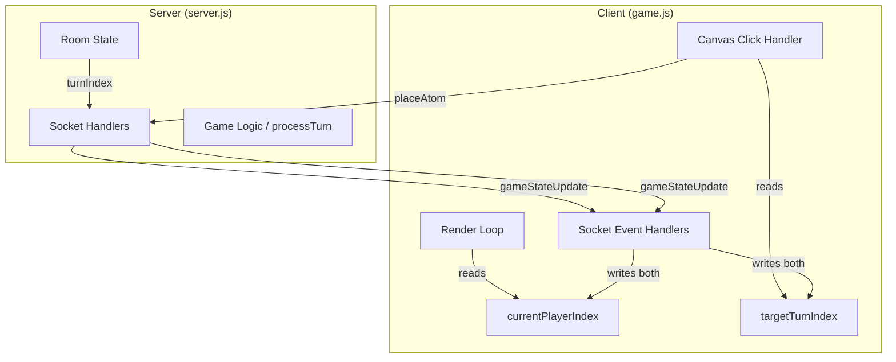
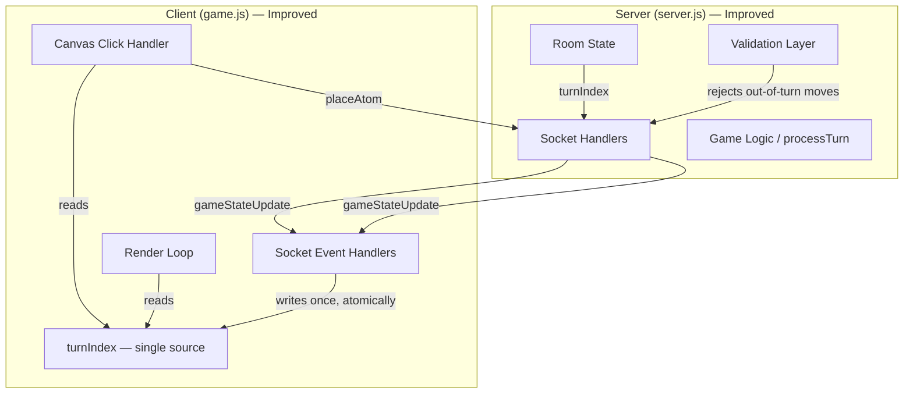
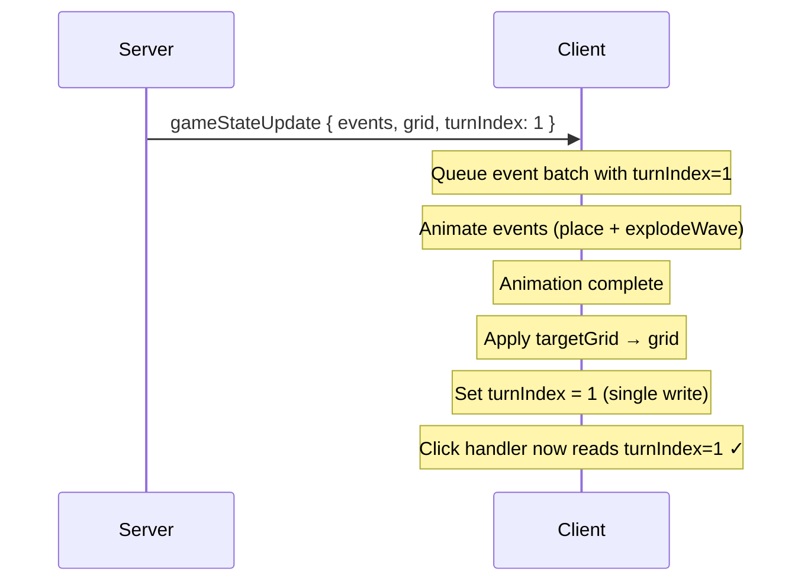
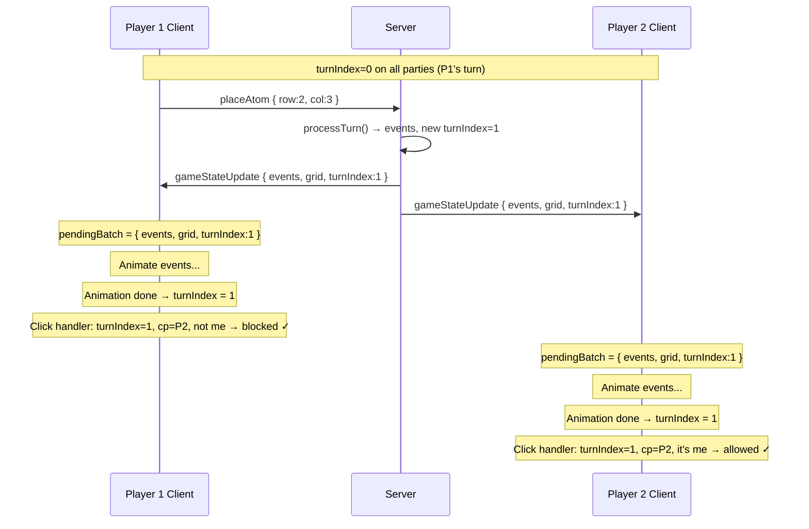
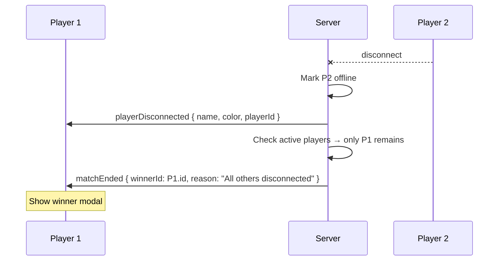
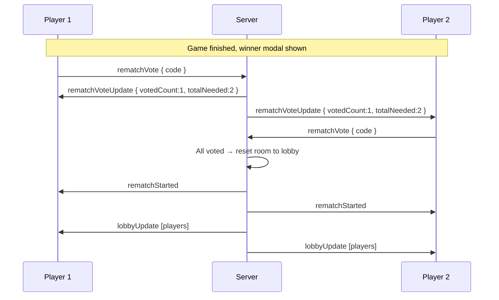

# Design Document: Chain Reaction Multiplayer Improvements

## Overview

This document covers a bundled set of improvements and a critical bugfix for the Chain Reaction multiplayer game. The game is a server-authoritative, real-time multiplayer strategy game built on Node.js + Socket.io with a vanilla JS canvas client.

The most critical issue is a turn synchronization bug that permanently deadlocks both players mid-game: the host and the non-host client both display "it's the other player's turn," making the game uncompletable. Beyond the bugfix, this spec also covers reliability improvements (reconnection handling, input debouncing, state reconciliation) and UX improvements (turn transition feedback, offline player skipping, and cleaner game-over flow).

The architecture remains server-authoritative throughout — the server is the single source of truth for all game state, and clients are pure renderers that send intent and receive authoritative state updates.

---

## Architecture

### Current Architecture



The dual-state problem: `currentPlayerIndex` drives rendering (HUD, grid color) while `targetTurnIndex` drives click validation. These two values can diverge during animation playback, causing the deadlock described below.

### Improved Architecture



---

## The Turn Synchronization Bug — Root Cause & Fix

### Root Cause Analysis

The client maintains two separate turn-tracking variables:

```javascript
let currentPlayerIndex = 0;  // used by: renderGrid(), updateHudStats()
let targetTurnIndex = 0;      // used by: canvas click handler, processServerEvents()
```

The `gameStateUpdate` handler sets `targetTurnIndex` immediately on receipt, but `currentPlayerIndex` is only updated inside `processServerEvents()` — which runs asynchronously during the animation loop, only after all projectile animations finish.

The deadlock sequence:

```
1. Player 1 places atom → server processes → emits gameStateUpdate{turnIndex: 1}
2. Client A: targetTurnIndex = 1, currentPlayerIndex still = 0 (animation pending)
3. Client B: targetTurnIndex = 1, currentPlayerIndex still = 0 (animation pending)
4. Animation finishes on Client A → processServerEvents sets currentPlayerIndex = 1
5. BUT: targetTurnIndex was already set to 1 before animation
6. Click handler on Client A: effectiveTurnIndex = targetTurnIndex = 1 → "not your turn"
7. Click handler on Client B: effectiveTurnIndex = targetTurnIndex = 1 → "it's your turn"
   BUT: if Client B's animation hasn't finished yet, targetTurnIndex may still be stale
```

The real failure mode is a race condition where `targetTurnIndex` is updated by a *second* `gameStateUpdate` event before the first animation sequence completes. When this happens, `processServerEvents` applies the old `targetTurnIndex` value (from the first event) to `currentPlayerIndex`, but the click handler is already using the newer `targetTurnIndex`. The two values permanently diverge.

Additionally, the click handler uses this logic:

```javascript
const effectiveTurnIndex = (targetTurnIndex !== undefined && targetTurnIndex !== null)
    ? targetTurnIndex : currentPlayerIndex;
```

This means `targetTurnIndex` always wins — even when it's stale from a previous event that hasn't been animated yet. Both clients end up with `effectiveTurnIndex` pointing to the same player, locking both out.

### Fix Design

**Eliminate the dual-state entirely.** The client should have one canonical turn index that is updated atomically when the animation sequence for a given server event completes.



Key changes:

1. Remove `targetTurnIndex` — replace with a single `turnIndex` variable
2. Remove `currentPlayerIndex` — same variable serves both rendering and click validation
3. The `gameStateUpdate` handler stores the incoming `turnIndex` in a pending event batch object, not in a live variable
4. `processServerEvents` applies the `turnIndex` only after the full animation sequence for that batch completes
5. The click handler reads the single `turnIndex` directly

---

## Components and Interfaces

### Server: Room State

```javascript
// Room object shape (server.js)
{
  code: string,
  host: socketId,
  players: Player[],        // ordered; index = turn order
  state: 'lobby' | 'playing' | 'finished',
  turnIndex: number,        // index into players[]
  turnCount: number,        // total turns taken (used for elimination grace period)
  grid: Cell[][],           // ROWS x COLS
  rematchVotes: Set<socketId>,
  winnerId: socketId | null,
}

// Player shape
{
  id: socketId,
  name: string,
  color: ColorName,         // 'red' | 'blue' | 'green' | 'yellow' | 'purple' | 'orange'
  offline: boolean,
}

// Cell shape
{
  count: number,            // atom count in this cell
  color: ColorName | null,  // owner color, null if empty
}
```

### Server: Socket Event Protocol

```
Client → Server:
  hostMatch    { name: string, color: ColorName }
  joinMatch    { code: string, name: string, color: ColorName }
  startMatch   code: string
  placeAtom    { code: string, row: number, col: number }
  rematchVote  code: string
  leaveGame    code: string

Server → Client (room broadcast):
  roomCreated        code: string
  roomJoined         { code: string, assignedName: string }
  lobbyUpdate        Player[]
  matchStarted       { players: Player[], turnIndex: number }
  gameStateUpdate    { events: GameEvent[], grid: Cell[][], turnIndex: number, turnCount: number }
  matchEnded         { winnerId: string, winnerName: string, winnerColor: ColorName, reason?: string }
  rematchVoteUpdate  { votedCount: number, totalNeeded: number, voterName: string }
  rematchStarted     (no payload)
  playerLeftGame     { name: string, color: ColorName }
  playerDisconnected { name: string, color: ColorName, playerId: string }
  errorMsg           message: string
```

### Server: Game Events (sent inside gameStateUpdate)

```javascript
// Atom placement event
{ type: 'place', row: number, col: number, color: ColorName }

// One wave of simultaneous explosions
{
  type: 'explodeWave',
  explosions: Array<{ row: number, col: number, color: ColorName }>
}
```

### Client: State Model (Improved)

```javascript
// Single turn index — replaces currentPlayerIndex + targetTurnIndex
let turnIndex = 0;

// Pending event batch — set on gameStateUpdate receipt, cleared after animation
let pendingBatch = null;
// Shape: { events: GameEvent[], grid: Cell[][], turnIndex: number, turnCount: number }
// NOTE: events can be empty array [] for immediate sync corrections (out-of-turn moves)

// Debounce flag to prevent rapid double-clicks
let waitingForServer = false;

// Game state
let grid = createGrid();
let projectiles = [];
let gameActive = false;
let enabledPlayers = [];
let myPlayerId = null;
let roomCode = null;
let amHost = false;
let winner = null;
let turnCount = 0;

// UI state
let statsDirty = true;  // triggers HUD re-render when true
let isRendering = false;
let animationFrame = 0;

// Rematch tracking
let hasVotedRematch = false;

// Visual feedback for disconnected players
let eliminatedPlayers = new Set();  // Set<playerId>
```

---

## Data Models

### Grid Cell

```javascript
// Immutable shape — cells are replaced, not mutated in place
{
  count: number,   // 0 = empty; >= criticalMass(r,c) = will explode
  color: string | null
}
```

**Validation rules:**
- `count >= 0` always
- `color` must be null when `count === 0`
- `color` must be non-null when `count > 0`
- Server rejects placement on a cell where `color !== null && color !== currentPlayer.color`

### Turn Advancement

```javascript
// Server-side: findNextPlayerIndex
// Skips offline players
// Skips eliminated players (count === 0 after grace period)
// Grace period: first N turns (N = player count) everyone is safe from elimination
function findNextPlayerIndex(room, counts) {
  let next = room.turnIndex;
  for (let step = 0; step < room.players.length; step++) {
    next = (next + 1) % room.players.length;
    const p = room.players[next];
    if (p.offline) continue;
    if (room.turnCount < room.players.length || counts[p.color] > 0) {
      return next;
    }
  }
  return room.turnIndex; // fallback: no valid next player (shouldn't happen)
}
```

---

## Key Algorithms with Formal Specifications

### Algorithm 1: processTurn (Server)

```pascal
ALGORITHM processTurn(room, row, col, playerColor)
INPUT:  room — current room state (mutated in place)
        row, col — target cell coordinates
        playerColor — color of the acting player
OUTPUT: events — ordered list of GameEvent for client animation

PRECONDITIONS:
  - room.state = 'playing'
  - room.players[room.turnIndex].color = playerColor
  - inBounds(row, col) = true
  - room.grid[row][col].count = 0 OR room.grid[row][col].color = playerColor

BEGIN
  events ← []

  // Step 1: Place atom
  room.grid[row][col].color ← playerColor
  room.grid[row][col].count ← room.grid[row][col].count + 1
  events.append({ type: 'place', row, col, color: playerColor })

  // Step 2: Resolve chain reaction (BFS wave-by-wave)
  safety ← 0
  WHILE safety < 1000 DO
    safety ← safety + 1

    // Collect all cells at or above critical mass
    explodingCells ← []
    FOR r ← 0 TO ROWS-1 DO
      FOR c ← 0 TO COLS-1 DO
        IF room.grid[r][c].count >= criticalMass(r, c) THEN
          explodingCells.append({ r, c, color: room.grid[r][c].color })
        END IF
      END FOR
    END FOR

    IF explodingCells.length = 0 THEN BREAK END IF

    // LOOP INVARIANT: all cells in explodingCells have count >= criticalMass

    waveEvent ← { type: 'explodeWave', explosions: [] }
    flyingAtoms ← []

    FOR EACH { r, c, color } IN explodingCells DO
      room.grid[r][c].count ← 0
      room.grid[r][c].color ← null
      waveEvent.explosions.append({ row: r, col: c, color })

      FOR EACH [nr, nc] IN neighbors(r, c) DO
        IF inBounds(nr, nc) THEN
          flyingAtoms.append({ r: nr, c: nc, color })
        END IF
      END FOR
    END FOR

    events.append(waveEvent)

    // Land all flying atoms (after clearing, to avoid double-counting)
    FOR EACH { r, c, color } IN flyingAtoms DO
      room.grid[r][c].color ← color
      room.grid[r][c].count ← room.grid[r][c].count + 1
    END FOR
  END WHILE

  // Step 3: Advance turn
  room.turnCount ← room.turnCount + 1
  counts ← getAtomCounts(room)

  // Step 4: Check win condition
  IF room.turnCount >= room.players.length THEN
    survivors ← players WHERE NOT offline AND counts[color] > 0
    IF survivors.length = 1 THEN
      room.state ← 'finished'
      room.winnerId ← survivors[0].id
    ELSE IF survivors.length = 0 THEN
      room.state ← 'finished'
      room.winnerId ← 'draw'
    END IF
  END IF

  // Step 5: Advance turn index (only if game still active)
  IF room.state ≠ 'finished' THEN
    room.turnIndex ← findNextPlayerIndex(room, counts)
  END IF

  RETURN events
END

POSTCONDITIONS:
  - events.length >= 1 (at minimum a 'place' event)
  - room.grid reflects the fully resolved state after all chain reactions
  - room.turnIndex points to the next valid (non-offline, non-eliminated) player
  - IF room.state = 'finished' THEN room.winnerId is set
```

### Algorithm 2: processServerEvents (Client — Fixed)

```pascal
ALGORITHM processServerEvents(now)
INPUT:  now — current timestamp (ms)
OUTPUT: (side effects on grid, turnIndex, projectiles)

PRECONDITIONS:
  - pendingBatch may be null (no pending work) or a batch object
  - projectiles may contain in-flight atoms

BEGIN
  // Wait for all projectiles to land before processing next wave
  IF projectiles.length > 0 THEN RETURN END IF

  IF pendingBatch = null THEN RETURN END IF

  IF pendingBatch.events.length = 0 THEN
    // All events in this batch are done — commit state atomically
    grid ← pendingBatch.grid
    turnIndex ← pendingBatch.turnIndex   // SINGLE WRITE — fixes the bug
    IF pendingBatch.turnCount ≠ undefined THEN
      turnCount ← pendingBatch.turnCount
    END IF
    pendingBatch ← null
    statsDirty ← true
    RETURN
  END IF

  // Process next event in the batch
  event ← pendingBatch.events.shift()

  IF event.type = 'place' THEN
    playAtomSound()
    grid[event.row][event.col].color ← event.color
    grid[event.row][event.col].count ← grid[event.row][event.col].count + 1
    statsDirty ← true

  ELSE IF event.type = 'explodeWave' THEN
    playExplosionSound()
    FOR EACH { row, col, color } IN event.explosions DO
      grid[row][col].count ← 0
      grid[row][col].color ← null
      { sx, sy } ← cellCenter(row, col)
      FOR EACH [nr, nc] IN neighbors(row, col) DO
        IF inBounds(nr, nc) THEN
          { ex, ey } ← cellCenter(nr, nc)
          projectiles.append({
            sx, sy, ex, ey,
            start: now, dur: explosionDurationMs,
            targetRow: nr, targetCol: nc,
            color, applied: false, done: false
          })
        END IF
      END FOR
    END FOR
    statsDirty ← true
  END IF
END

POSTCONDITIONS:
  - turnIndex is only updated after ALL events in a batch are processed
  - grid is only replaced with server's authoritative grid after batch completes
  - No partial state is ever visible to the click handler
```

### Algorithm 3: Click Handler (Client — Fixed)

```pascal
ALGORITHM handleCanvasClick(event)
INPUT:  event — mouse/touch click event

PRECONDITIONS:
  - gameActive = true
  - winner = null

BEGIN
  IF NOT gameActive OR winner ≠ null THEN RETURN END IF
  
  // CRITICAL: Check animation state BEFORE reading turnIndex
  // This prevents race conditions during event processing
  IF projectiles.length > 0 OR pendingBatch ≠ null THEN RETURN END IF
  
  // CRITICAL: Check debounce flag to prevent rapid double-clicks
  IF waitingForServer THEN RETURN END IF

  col ← floor((event.clientX - rect.left) * scaleX / cellWidth)
  row ← floor((event.clientY - rect.top) * scaleY / cellHeight)

  IF NOT inBounds(row, col) THEN RETURN END IF

  // Single source of truth — no effectiveTurnIndex calculation needed
  // Safe to read turnIndex here because pendingBatch is null (checked above)
  cp ← enabledPlayers[turnIndex]

  IF cp.id ≠ myPlayerId THEN
    showToast("It's " + cp.name + "'s turn.")
    RETURN
  END IF

  cell ← grid[row][col]
  IF cell.count = 0 OR cell.color = cp.color THEN
    waitingForServer ← true  // Set debounce flag
    socket.emit('placeAtom', { code: roomCode, row, col })
  ELSE
    showToast("You can only place on empty cells or your own.")
  END IF
END

POSTCONDITIONS:
  - placeAtom is only emitted when it is genuinely this client's turn
  - No move is sent while animation is in progress
  - waitingForServer flag prevents double-submission
```

---

## Sequence Diagrams

### Normal Turn Flow (Fixed)



### Disconnect Mid-Game



### Rematch Flow



---

## Error Handling

### Out-of-Turn Move

**Condition**: Client emits `placeAtom` when it's not their turn (e.g., due to network lag or a stale UI state).

**Server response**: Emit `gameStateUpdate` with no events, just the current authoritative `grid` and `turnIndex` back to the offending socket only.

**Client response**: On receiving a `gameStateUpdate` with empty `events`, immediately sync `grid` and `turnIndex` from the server payload. This acts as a self-correction mechanism.

```javascript
// server.js — placeAtom handler
if (currentPlayer.id !== socket.id) {
  socket.emit('gameStateUpdate', {
    events: [],
    grid: room.grid,
    turnIndex: room.turnIndex,
    turnCount: room.turnCount
  });
  return;
}
```

```javascript
// game.js — gameStateUpdate handler (improved)
socket.on('gameStateUpdate', ({ events, grid: serverGrid, turnIndex: serverTurnIndex, turnCount: serverTurnCount }) => {
  if (!gameActive) return;

  // Clear debounce flag on any server response
  waitingForServer = false;

  if (!events || events.length === 0) {
    // Authoritative correction — apply immediately, no animation
    // This handles out-of-turn moves and other sync corrections
    grid = serverGrid;
    turnIndex = serverTurnIndex;
    if (serverTurnCount !== undefined) turnCount = serverTurnCount;
    statsDirty = true;
    if (!isRendering) { isRendering = true; requestAnimationFrame(render); }
    return;
  }

  // Queue as a batch — turnIndex applied only after animation completes
  pendingBatch = { events: [...events], grid: serverGrid, turnIndex: serverTurnIndex, turnCount: serverTurnCount };
  
  if (!isRendering) {
    isRendering = true;
    requestAnimationFrame(render);
  }
});
```

### Player Disconnects During Their Turn

**Condition**: The player whose turn it is disconnects.

**Server behavior**: Mark player offline → call `findNextPlayerIndex` → if only 1 active player remains, end game. Otherwise, the turn naturally advances to the next active player on the next `placeAtom` event (since `findNextPlayerIndex` skips offline players).

**Gap**: Currently the server does not proactively advance the turn when a player disconnects mid-turn. This means the remaining players see a frozen turn indicator.

**Fix**: After marking a player offline during `'playing'` state, if the disconnected player was the current turn holder, immediately advance `room.turnIndex` and broadcast a `gameStateUpdate` with empty events to sync all clients.

```pascal
// In disconnect handler, after marking player offline:
IF room.state = 'playing' THEN
  IF room.players[room.turnIndex].id = disconnectedPlayer.id THEN
    counts ← getAtomCounts(room)
    room.turnIndex ← findNextPlayerIndex(room, counts)
    io.to(code).emit('gameStateUpdate', {
      events: [],
      grid: room.grid,
      turnIndex: room.turnIndex,
      turnCount: room.turnCount
    })
  END IF
END IF
```

### Rapid Double-Click / Input Debounce

**Condition**: Player clicks rapidly before the server responds, sending multiple `placeAtom` events.

**Current behavior**: The server correctly rejects the second event (it's no longer that player's turn after the first is processed), but the client has no local guard.

**Fix**: Set a `waitingForServer` flag on click, cleared when `gameStateUpdate` is received. The click handler checks this flag.

```javascript
let waitingForServer = false;

// In click handler (see Algorithm 3 above):
if (waitingForServer) return;
waitingForServer = true;
socket.emit('placeAtom', { code: roomCode, row, col });

// In gameStateUpdate handler (see Out-of-Turn Move section above):
waitingForServer = false;  // Clear on ANY server response
```

**Why this works**: The flag is set immediately on click and cleared on any `gameStateUpdate` response (whether it's a valid move, sync correction, or rejection). This prevents the client from sending multiple requests before the server responds, while still allowing the next move after the server confirms the previous one.

### Room Code Collision

**Condition**: `generateRoomCode()` produces a code that already exists.

**Current behavior**: Already handled with a `while (rooms[code])` retry loop. No change needed.

### Stale Room After All Players Leave

**Condition**: All players disconnect or leave, leaving an empty room object in memory.

**Current behavior**: Already handled — `delete rooms[code]` when `room.players.length === 0`. No change needed.

---

## Testing Strategy

### Unit Testing Approach

Test the pure game logic functions in isolation (no socket, no Express):

- `criticalMass(row, col)` — verify corner=2, edge=3, center=4 for a 9x6 grid
- `processTurn(room, row, col, color)` — verify event sequence for simple placements and chain reactions
- `findNextPlayerIndex(room, counts)` — verify skipping of offline and eliminated players
- `ensureUniqueName(room, name)` — verify deduplication logic

### Property-Based Testing Approach

**Property Test Library**: fast-check

Key properties to verify:

1. **Turn advancement is always valid**: After any `processTurn`, `room.turnIndex` always points to a non-offline, non-eliminated player (or the game is finished).

2. **Chain reaction terminates**: `processTurn` always completes within the safety limit (1000 iterations). For any valid board state and placement, the while loop exits.

3. **Atom conservation during explosions**: The total atom count on the board can only increase by 1 per `processTurn` call (the placed atom). Explosions redistribute but do not create or destroy atoms.
   - Formally: `sum(grid.atoms after) = sum(grid.atoms before) + 1`

4. **Color ownership is consistent**: After any `processTurn`, every cell with `count > 0` has a non-null `color`, and every cell with `count === 0` has `color === null`.

5. **Win condition is sound**: If `matchEnded` is emitted, the winner has atoms on the board and all other non-offline players have zero atoms.

6. **Client state consistency**: After `processServerEvents` completes (pendingBatch becomes null), `turnIndex` must match the server's last sent `turnIndex`, and `grid` must match the server's authoritative grid.

### Integration Testing Approach

Simulate two Socket.io clients connecting to a live server instance:

- Full game flow: host → join → start → alternate turns → win
- Turn sync: verify both clients have identical `turnIndex` after each `gameStateUpdate`
- Disconnect recovery: disconnect the current-turn player, verify remaining client's turn indicator updates
- Rematch: complete a game, both clients vote rematch, verify lobby state resets
- Double-click prevention: simulate rapid clicks, verify only one `placeAtom` is sent before server responds
- Out-of-turn rejection: client sends move when not their turn, verify client receives sync correction and updates `turnIndex`

---

## Performance Considerations

- The explosion chain resolution loop has a safety cap of 1000 iterations. For a 6x9 = 54 cell grid, the theoretical maximum chain length is bounded by the number of cells, so 1000 is more than sufficient and adds negligible overhead.
- `getAtomCounts` iterates all 54 cells — O(ROWS × COLS) = O(54), negligible.
- The client render loop uses `requestAnimationFrame` and stops when `gameActive === false` and no animations are pending. No idle CPU usage between games.
- Socket.io rooms ensure broadcasts are scoped to room members only — no global fan-out.

---

## Security Considerations

- All game logic runs server-side. Clients send only intent (`placeAtom` with coordinates), never state mutations.
- The server validates: player identity (socket.id), turn ownership, cell bounds, cell ownership, and room/game state before processing any move.
- Room codes are 4-character alphanumeric (36^4 = ~1.7M combinations). Not cryptographically secure, but sufficient for casual play. For production, consider 6-character codes or rate-limiting join attempts.
- Player names are trimmed and capped at 12 characters server-side. No HTML is rendered from player names in the canvas (only in the HUD DOM — should be text-content, not innerHTML, to prevent XSS).
- No authentication — any socket can join any room with the correct code. This is by design for a casual game.

---

## Dependencies

- **Node.js** — runtime
- **Express 5** — static file serving
- **Socket.io 4** — real-time bidirectional communication
- **cors** — cross-origin headers for development
- **Electron** (optional) — desktop wrapper via `main.js` / `preload.js`
- No client-side dependencies — vanilla JS, no frameworks or bundlers


---

## Correctness Properties

*A property is a characteristic or behavior that should hold true across all valid executions of a system—essentially, a formal statement about what the system should do. Properties serve as the bridge between human-readable specifications and machine-verifiable correctness guarantees.*

### Property 1: Turn Index Atomic Update After Animation

*For any* client receiving a game state update with events, the turn index SHALL only be updated after all animations in that batch complete, ensuring the click handler never reads a partially-updated turn state.

**Validates: Requirements 1.3, 1.4**

### Property 2: Server Turn Index Always Valid

*For any* game state on the server where state is 'playing', the turn index SHALL point to a player who is not offline and (if past grace period) has atoms on the board.

**Validates: Requirements 1.7, 5.2**

### Property 3: Game State Updates Include Turn Index

*For any* game state update event broadcast by the server, the event SHALL contain the authoritative turn index field.

**Validates: Requirements 1.6**

### Property 4: Debounce Prevents Duplicate Submissions

*For any* sequence of rapid clicks before server response, only the first click SHALL result in a placeAtom emission to the server.

**Validates: Requirements 2.2**

### Property 5: Out-of-Turn Moves Trigger Sync Correction

*For any* placeAtom request where the requesting socket ID does not match the current turn holder, the server SHALL send a game state update with empty events to that client only.

**Validates: Requirements 2.4, 2.5, 11.2**

### Property 6: Sync Corrections Applied Immediately

*For any* game state update with empty events array, the client SHALL apply the grid and turn index immediately without queueing or animation.

**Validates: Requirements 2.6, 4.1**

### Property 7: Client Grid Matches Server After Batch

*For any* completed event batch (pendingBatch becomes null), the client's grid SHALL be identical to the server's authoritative grid from that update.

**Validates: Requirements 4.2, 6.6**

### Property 8: Clicks Blocked During Animation

*For any* click event while projectiles are in flight or a pending batch exists, the click handler SHALL not process the click or emit placeAtom.

**Validates: Requirements 4.3**

### Property 9: Game State Updates Include Complete Grid

*For any* game state update event, the server SHALL include the complete authoritative grid state with all cells.

**Validates: Requirements 4.5**

### Property 10: Disconnect Marks Player Offline

*For any* player disconnect during 'playing' state, the server SHALL mark that player's offline flag as true.

**Validates: Requirements 3.1**

### Property 11: Disconnect Broadcasts Notification

*For any* player disconnect during 'playing' state, the server SHALL broadcast a playerDisconnected event to all remaining clients in the room.

**Validates: Requirements 3.2**

### Property 12: Current Player Disconnect Advances Turn

*For any* disconnect where the disconnected player's ID matches the current turn holder, the server SHALL advance the turn index and broadcast a sync update.

**Validates: Requirements 3.3**

### Property 13: Turn Advancement Skips Offline Players

*For any* turn advancement, the findNextPlayerIndex algorithm SHALL skip all players marked as offline.

**Validates: Requirements 3.4, 5.3**

### Property 14: Last Player Standing Wins

*For any* game state where exactly one non-offline player remains, the server SHALL set state to 'finished' and declare that player the winner.

**Validates: Requirements 3.5**

### Property 15: Grace Period Protects All Players

*For any* turn where turnCount is less than the number of players, all non-offline players SHALL be eligible for turns regardless of atom count.

**Validates: Requirements 5.4**

### Property 16: Post-Grace Elimination Skips Zero-Atom Players

*For any* turn where turnCount exceeds the number of players, players with zero atoms SHALL be skipped during turn advancement.

**Validates: Requirements 5.5**

### Property 17: No Valid Players Ends Game

*For any* turn advancement where no valid next player exists (all are offline or eliminated), the server SHALL set state to 'finished'.

**Validates: Requirements 5.6**

### Property 18: Explode Wave Clears Cells

*For any* explodeWave event processed by the client, all cells listed in the explosions array SHALL have their count set to 0 and color set to null.

**Validates: Requirements 6.4**

### Property 19: Single Survivor Wins

*For any* game state after grace period where exactly one non-offline player has atoms remaining, the server SHALL set state to 'finished' and that player as winner.

**Validates: Requirements 7.2**

### Property 20: Zero Survivors Is Draw

*For any* game state after grace period where zero non-offline players have atoms remaining, the server SHALL set state to 'finished' and winnerId to 'draw'.

**Validates: Requirements 7.3**

### Property 21: Game End Broadcasts Match Ended

*For any* state transition to 'finished', the server SHALL broadcast a matchEnded event to all clients in the room.

**Validates: Requirements 7.4**

### Property 22: Match Ended Contains Winner Info

*For any* matchEnded event, the event SHALL include winnerId, winnerName, winnerColor, and optional reason fields.

**Validates: Requirements 7.5**

### Property 23: Rematch Vote Broadcasts Update

*For any* rematchVote received, the server SHALL broadcast a rematchVoteUpdate event showing current vote count and total needed.

**Validates: Requirements 8.3**

### Property 24: All Votes Trigger Rematch

*For any* room in 'finished' state where all non-offline players have voted for rematch, the server SHALL reset state to 'lobby' and broadcast rematchStarted.

**Validates: Requirements 8.4, 13.7**

### Property 25: Rematch Resets Game State

*For any* rematch trigger, the server SHALL clear the grid, reset turnIndex to 0, reset turnCount to 0, and clear rematchVotes set.

**Validates: Requirements 8.5**

### Property 26: Rematch Broadcasts Sequence

*For any* rematch trigger, the server SHALL broadcast rematchStarted followed by lobbyUpdate in that order.

**Validates: Requirements 8.6**

### Property 27: Room Code Generation Uniqueness

*For any* generated room code, if the code already exists in the rooms object, the server SHALL retry generation until a unique code is found.

**Validates: Requirements 9.2, 18.6**

### Property 28: Room Code Format

*For any* generated room code, the code SHALL be exactly 4 characters long and contain only alphanumeric characters (A-Z, 0-9).

**Validates: Requirements 18.4, 18.5**

### Property 29: Join Validates Room Exists and State

*For any* joinMatch request, the server SHALL validate that the room code exists and the room state is 'lobby' before allowing the join.

**Validates: Requirements 9.3**

### Property 30: Full Room Rejects Joins

*For any* joinMatch request to a room with 6 players, the server SHALL reject the join and send an errorMsg.

**Validates: Requirements 9.4**

### Property 31: Color Conflict Rejects Join

*For any* joinMatch request where the requested color is already taken by another player, the server SHALL reject the join and send an errorMsg listing available colors.

**Validates: Requirements 9.5, 14.5**

### Property 32: Duplicate Names Get Deduplicated

*For any* player joining with a name that already exists in the room, the server SHALL append (2), (3), etc. until the name is unique.

**Validates: Requirements 9.6**

### Property 33: Player List Changes Broadcast Lobby Update

*For any* change to the room's player list (join, leave, disconnect in lobby), the server SHALL broadcast a lobbyUpdate event to all clients in the room.

**Validates: Requirements 9.7**

### Property 34: Start Validates Host

*For any* startMatch request, the server SHALL validate that the requesting socket ID matches the room's host ID.

**Validates: Requirements 10.2**

### Property 35: Start Validates Lobby State

*For any* startMatch request, the server SHALL validate that the room state is 'lobby' before allowing the match to start.

**Validates: Requirements 10.3**

### Property 36: Start Validates Minimum Players

*For any* startMatch request to a room with fewer than 2 players, the server SHALL reject the request and send an errorMsg.

**Validates: Requirements 10.4**

### Property 37: Start Validation Failure Sends Error

*For any* startMatch request that fails validation (not host, not lobby, or < 2 players), the server SHALL send an errorMsg to the requesting client.

**Validates: Requirements 10.5**

### Property 38: Valid Start Transitions to Playing

*For any* valid startMatch request, the server SHALL set room state to 'playing' and broadcast matchStarted to all clients.

**Validates: Requirements 10.6, 10.7**

### Property 39: Place Atom Validates Playing State

*For any* placeAtom request, the server SHALL validate that the room state is 'playing' before processing the move.

**Validates: Requirements 11.1**

### Property 40: Place Atom Validates Bounds

*For any* placeAtom request, the server SHALL validate that the target row and column are within grid bounds (0 <= row < ROWS, 0 <= col < COLS).

**Validates: Requirements 11.3, 20.3**

### Property 41: Place Atom Validates Cell Ownership

*For any* placeAtom request, the server SHALL validate that the target cell is either empty (count = 0) or owned by the current player (color matches).

**Validates: Requirements 11.4, 20.4**

### Property 42: Valid Move Generates Events

*For any* placeAtom request that passes all validations, the server SHALL execute processTurn and generate at least one event (the 'place' event).

**Validates: Requirements 11.6**

### Property 43: Valid Move Broadcasts Update

*For any* placeAtom request that passes all validations, the server SHALL broadcast a gameStateUpdate to all clients in the room.

**Validates: Requirements 11.7**

### Property 44: Atom Placement Updates Cell

*For any* atom placement, the server SHALL increment the target cell's count by 1 and set the cell's color to the current player's color.

**Validates: Requirements 12.1**

### Property 45: Critical Mass Triggers Explosion

*For any* cell where count >= criticalMass(row, col), the server SHALL include that cell in the next explodeWave event.

**Validates: Requirements 12.3**

### Property 46: Explosion Clears Cell and Sends Atoms

*For any* exploding cell, the server SHALL set count to 0, set color to null, and create flying atoms to all valid neighboring cells.

**Validates: Requirements 12.4**

### Property 47: Chain Reactions Terminate

*For any* processTurn execution, the explosion resolution loop SHALL complete within 1000 iterations.

**Validates: Requirements 12.6, 12.7, 19.1**

### Property 48: Atom Conservation

*For any* processTurn execution, the total atom count on the grid after processing SHALL equal the total atom count before plus exactly 1 (the placed atom).

**Validates: Requirements 12.1, 12.4**

### Property 49: Color Ownership Consistency

*For any* grid state after processTurn, every cell with count > 0 SHALL have a non-null color, and every cell with count = 0 SHALL have null color.

**Validates: Requirements 12.1**

### Property 50: Leave Removes Player

*For any* leaveGame request, the server SHALL remove the requesting player from the room's player list.

**Validates: Requirements 13.1**

### Property 51: Leave Clears Rematch Vote

*For any* leaveGame request, the server SHALL remove the player's socket ID from the room's rematchVotes set.

**Validates: Requirements 13.2**

### Property 52: Leave Broadcasts Notification

*For any* leaveGame request, the server SHALL broadcast a playerLeftGame event to all remaining clients in the room.

**Validates: Requirements 13.3**

### Property 53: Host Leave Reassigns Host

*For any* leaveGame or disconnect where the leaving player is the host, the server SHALL reassign the host to the first player in the remaining player list.

**Validates: Requirements 13.4**

### Property 54: Empty Room Cleanup

*For any* room where the player list becomes empty (length = 0), the server SHALL delete the room from the rooms object.

**Validates: Requirements 13.5, 19.5**

### Property 55: Invalid Action Sends Error

*For any* player action that fails server validation, the server SHALL send an errorMsg event to the requesting client.

**Validates: Requirements 14.1**

### Property 56: Invalid Name Sends Descriptive Error

*For any* hostMatch or joinMatch request with an invalid name (empty, too long), the server SHALL send an errorMsg describing the validation failure.

**Validates: Requirements 14.3**

### Property 57: Invalid Room Code Sends Error

*For any* joinMatch request with a room code that doesn't exist, the server SHALL send an errorMsg indicating the room was not found.

**Validates: Requirements 14.4**

### Property 58: Player Name Length Limit

*For any* player name, the server SHALL trim whitespace and enforce a maximum length of 12 characters.

**Validates: Requirements 20.5**

### Property 59: Multiple Room Prevention

*For any* hostMatch or joinMatch request, the server SHALL check if the requesting socket is already in a room and reject with an errorMsg if true.

**Validates: Requirements 20.6**
