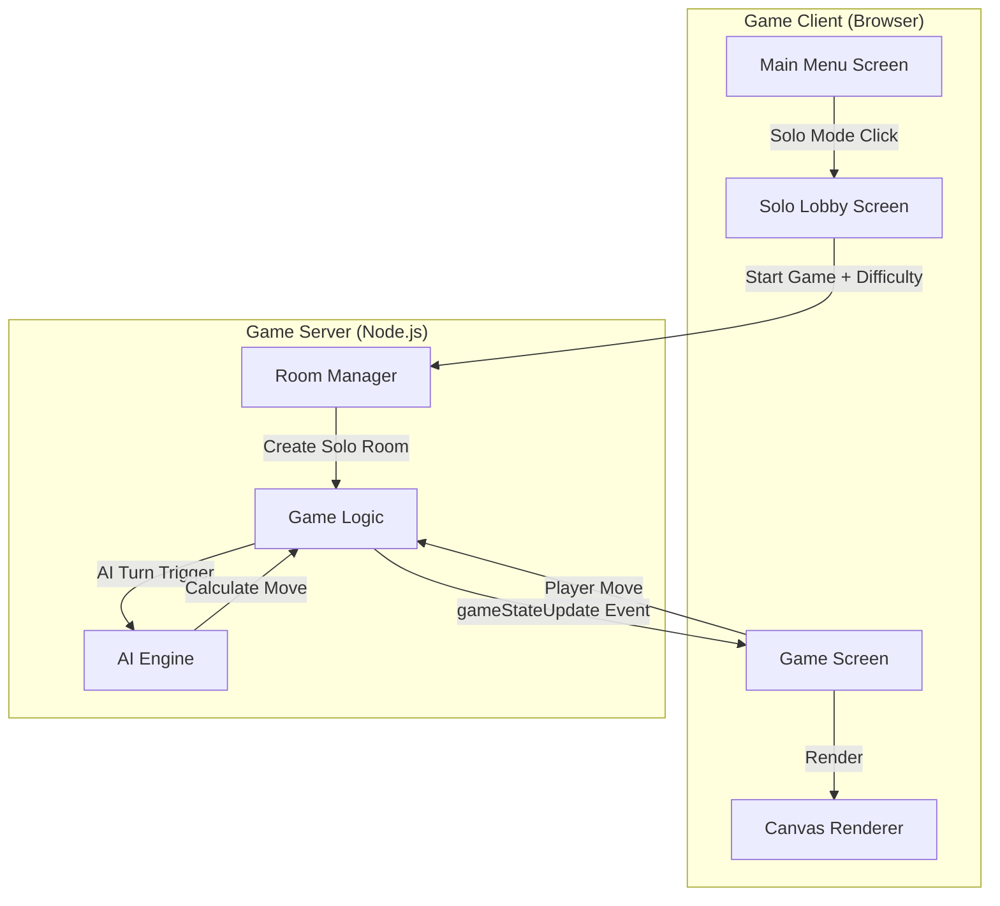
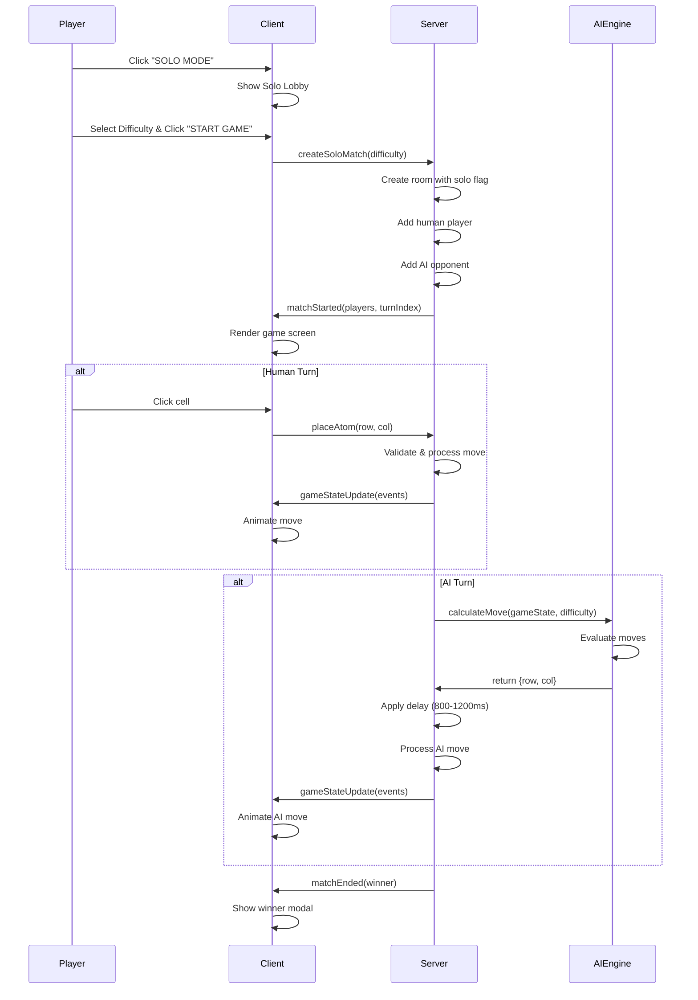
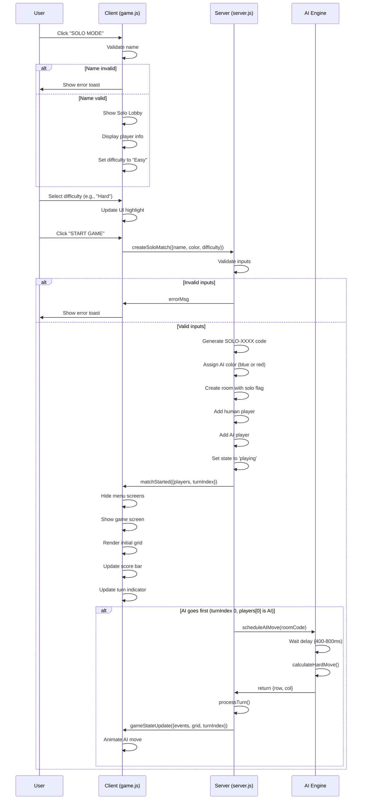
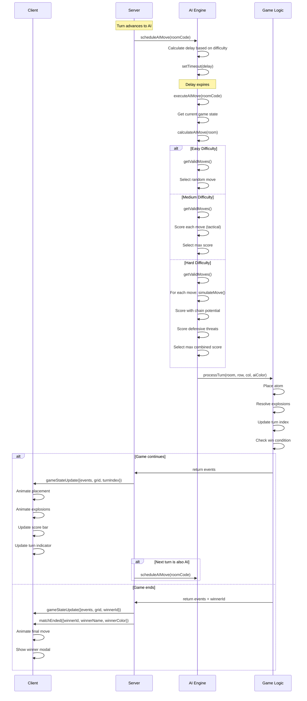
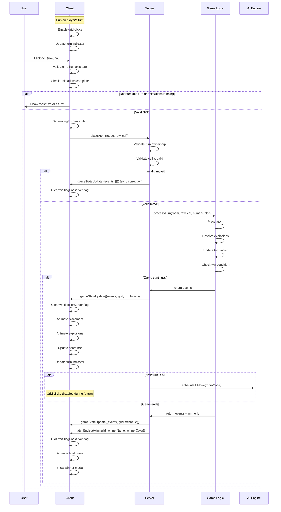
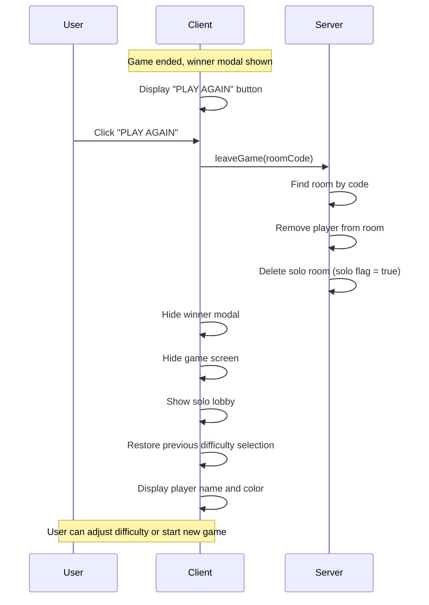

# Solo Player Mode Design Document

## Overview

The Solo Player Mode feature adds single-player practice functionality to the Chain Reaction multiplayer game. Players can compete against AI opponents with three difficulty levels (Easy, Medium, Hard) to learn game mechanics and improve their skills before entering multiplayer matches.

### Key Design Principles

1. **Server-Authoritative Architecture**: AI move calculation occurs server-side to maintain consistency with the existing multiplayer architecture
2. **Seamless Integration**: Solo mode reuses existing game screens, rendering logic, and network protocols
3. **Progressive Difficulty**: Three AI difficulty levels provide appropriate challenges for beginners through advanced players
4. **Isolated State**: Solo games use separate room instances that don't interfere with multiplayer sessions

### Feature Scope

- Solo mode selection from main menu
- AI opponent configuration (Easy/Medium/Hard difficulty)
- Server-side AI move calculation with three distinct algorithms
- Client-side UI integration with existing game screens
- Solo-specific room management and lifecycle

## Architecture

### High-Level Component Diagram




### Integration with Existing System

The solo mode integrates with the existing multiplayer architecture by:

1. **Reusing Room State Machine**: Solo games use the same `rooms` data structure with an additional `solo: true` flag
2. **Leveraging Existing Events**: AI moves emit the same `gameStateUpdate` events as human players
3. **Maintaining Server Authority**: All move validation and game state updates remain server-side
4. **Sharing UI Components**: Solo games render using the same canvas, score bar, and turn indicator as multiplayer

### Data Flow Sequence




## Components and Interfaces

### Client-Side Components

#### 1. Main Menu Extension

**Location**: `index.html` + `game.js`

**New UI Elements**:
```html
<button id="show-solo-btn" class="btn btn-green btn-lg btn-block">
    <span class="btn-content">SOLO MODE</span>
</button>
```

**Event Handler**:
```javascript
showSoloBtn.addEventListener('click', () => {
    const name = validateName();
    if (!name) return;
    const color = playerColorSelect.value;
    authPanel.classList.add('hidden');
    soloLobbyPanel.classList.remove('hidden');
});
```

#### 2. Solo Lobby Screen

**Location**: `index.html` (new panel)

**UI Structure**:
```html
<div class="card card-accent hidden" id="solo-lobby-panel">
    <div class="form-group">
        <label>PLAYER</label>
        <div class="player-display">
            <span id="solo-player-name">Player Name</span>
            <span id="solo-player-color-dot" class="dot"></span>
        </div>
    </div>
    
    <div class="form-group">
        <label>DIFFICULTY</label>
        <div class="difficulty-selector">
            <button class="difficulty-btn active" data-difficulty="easy">EASY</button>
            <button class="difficulty-btn" data-difficulty="medium">MEDIUM</button>
            <button class="difficulty-btn" data-difficulty="hard">HARD</button>
        </div>
    </div>
    
    <div class="home-actions">
        <button id="start-solo-game-btn" class="btn btn-green btn-lg btn-block">
            <span class="btn-content">START GAME</span>
        </button>
        <button id="back-from-solo-btn" class="btn btn-white btn-md btn-block">
            <span class="btn-content">BACK</span>
        </button>
    </div>
</div>
```

**State Management**:
```javascript
let selectedDifficulty = 'easy'; // Default difficulty

document.querySelectorAll('.difficulty-btn').forEach(btn => {
    btn.addEventListener('click', () => {
        document.querySelectorAll('.difficulty-btn').forEach(b => 
            b.classList.remove('active'));
        btn.classList.add('active');
        selectedDifficulty = btn.dataset.difficulty;
    });
});
```


#### 3. Game Screen Modifications

**Winner Modal Update**:
```javascript
// Detect solo mode and adjust button text
if (roomCode && rooms[roomCode]?.solo) {
    modalRematchBtn.querySelector('.btn-content').textContent = 'PLAY AGAIN';
}

// Play Again handler for solo mode
modalRematchBtn.addEventListener('click', () => {
    if (isSoloMode) {
        returnToSoloLobby(); // Preserve difficulty selection
    } else {
        socket.emit('rematchVote', roomCode);
    }
});
```

### Server-Side Components

#### 1. Solo Room Manager

**Location**: `server.js` (new socket event handlers)

**Room Structure Extension**:
```javascript
{
    code: 'SOLO-XXXX',
    host: socketId,
    players: [
        { id: socketId, name: 'PlayerName', color: 'red', offline: false },
        { id: 'AI', name: 'AI (Easy)', color: 'blue', offline: false, isAI: true }
    ],
    state: 'lobby' | 'playing' | 'finished',
    solo: true,              // NEW: Solo mode flag
    difficulty: 'easy',      // NEW: AI difficulty level
    turnIndex: 0,
    turnCount: 0,
    grid: Array,
    rematchVotes: Set,
    winnerId: null
}
```

**Socket Event: createSoloMatch**
```javascript
socket.on('createSoloMatch', ({ name, color, difficulty }) => {
    // Validate inputs
    const trimmedName = (name || '').trim();
    if (!trimmedName || trimmedName.length < 1) {
        socket.emit('errorMsg', 'Please enter a player name.');
        return;
    }
    
    if (!VALID_COLORS.includes(color)) {
        socket.emit('errorMsg', 'Invalid color selection.');
        return;
    }
    
    if (!['easy', 'medium', 'hard'].includes(difficulty)) {
        socket.emit('errorMsg', 'Invalid difficulty level.');
        return;
    }
    
    // Generate solo room code
    let code = 'SOLO-' + generateRoomCode();
    while (rooms[code]) {
        code = 'SOLO-' + generateRoomCode();
    }
    
    // Assign AI color (prefer blue, fallback to red if player chose blue)
    const aiColor = color === 'blue' ? 'red' : 'blue';
    
    // Create solo room
    rooms[code] = {
        code,
        host: socket.id,
        players: [
            { id: socket.id, name: trimmedName, color, offline: false },
            { id: 'AI', name: `AI (${difficulty.charAt(0).toUpperCase() + difficulty.slice(1)})`, 
              color: aiColor, offline: false, isAI: true }
        ],
        state: 'playing', // Start immediately (no lobby wait)
        solo: true,
        difficulty,
        turnIndex: 0,
        turnCount: 0,
        grid: createGrid(),
        rematchVotes: new Set(),
        winnerId: null
    };
    
    socket.join(code);
    
    // Start game immediately
    io.to(code).emit('matchStarted', {
        players: rooms[code].players,
        turnIndex: 0
    });
    
    // If AI goes first (turnIndex 0 and players[0] is AI), trigger AI move
    if (rooms[code].players[0].isAI) {
        scheduleAIMove(code);
    }
});
```


#### 2. AI Engine

**Location**: `server.js` (new module)

**Core AI Interface**:
```javascript
/**
 * Calculate the best move for the AI opponent
 * @param {Object} room - The game room state
 * @returns {Object} - {row, col} coordinates of the selected move
 */
function calculateAIMove(room) {
    const aiPlayer = room.players.find(p => p.isAI);
    const validMoves = getValidMoves(room.grid, aiPlayer.color);
    
    if (validMoves.length === 0) {
        console.error(`No valid moves for AI in room ${room.code}`);
        return null;
    }
    
    switch (room.difficulty) {
        case 'easy':
            return calculateEasyMove(validMoves);
        case 'medium':
            return calculateMediumMove(room, validMoves, aiPlayer.color);
        case 'hard':
            return calculateHardMove(room, validMoves, aiPlayer.color);
        default:
            return calculateEasyMove(validMoves);
    }
}

/**
 * Get all valid moves for a player
 * @param {Array} grid - The game grid
 * @param {string} color - The player's color
 * @returns {Array} - Array of {row, col} coordinates
 */
function getValidMoves(grid, color) {
    const moves = [];
    for (let r = 0; r < ROWS; r++) {
        for (let c = 0; c < COLS; c++) {
            const cell = grid[r][c];
            // Valid if empty or owned by this player
            if (cell.count === 0 || cell.color === color) {
                moves.push({ row: r, col: c });
            }
        }
    }
    return moves;
}

/**
 * Schedule an AI move with appropriate delay
 * @param {string} roomCode - The room code
 */
function scheduleAIMove(roomCode) {
    const room = rooms[roomCode];
    if (!room || room.state !== 'playing') return;
    
    const currentPlayer = room.players[room.turnIndex];
    if (!currentPlayer || !currentPlayer.isAI) return;
    
    // Calculate delay based on difficulty
    const delays = {
        easy: { min: 800, max: 1200 },
        medium: { min: 600, max: 1000 },
        hard: { min: 400, max: 800 }
    };
    
    const delay = delays[room.difficulty];
    const waitTime = delay.min + Math.random() * (delay.max - delay.min);
    
    setTimeout(() => {
        executeAIMove(roomCode);
    }, waitTime);
}

/**
 * Execute the AI move
 * @param {string} roomCode - The room code
 */
function executeAIMove(roomCode) {
    const room = rooms[roomCode];
    if (!room || room.state !== 'playing') return;
    
    const currentPlayer = room.players[room.turnIndex];
    if (!currentPlayer || !currentPlayer.isAI) return;
    
    const move = calculateAIMove(room);
    if (!move) {
        // No valid moves - end game
        room.state = 'finished';
        const humanPlayer = room.players.find(p => !p.isAI);
        room.winnerId = humanPlayer.id;
        io.to(roomCode).emit('matchEnded', {
            winnerId: humanPlayer.id,
            winnerName: humanPlayer.name,
            winnerColor: humanPlayer.color,
            reason: 'AI has no valid moves.'
        });
        return;
    }
    
    // Execute the move using existing game logic
    const events = processTurn(room, move.row, move.col, currentPlayer.color);
    
    io.to(roomCode).emit('gameStateUpdate', {
        events,
        grid: room.grid,
        turnIndex: room.turnIndex,
        turnCount: room.turnCount,
        winnerId: room.winnerId
    });
    
    if (room.state === 'finished') {
        const winnerPlayer = room.players.find(p => p.id === room.winnerId);
        io.to(roomCode).emit('matchEnded', {
            winnerId: room.winnerId,
            winnerName: winnerPlayer ? winnerPlayer.name : 'Unknown',
            winnerColor: winnerPlayer ? winnerPlayer.color : 'blue'
        });
    } else if (room.players[room.turnIndex].isAI) {
        // AI has another turn (rare but possible)
        scheduleAIMove(roomCode);
    }
}
```


#### 3. AI Algorithms

**Easy AI Algorithm**:
```javascript
/**
 * Easy AI: Random move selection
 * Selects a random valid move without any strategic consideration
 * 
 * @param {Array} validMoves - Array of {row, col} valid moves
 * @returns {Object} - {row, col} selected move
 */
function calculateEasyMove(validMoves) {
    const randomIndex = Math.floor(Math.random() * validMoves.length);
    return validMoves[randomIndex];
}
```

**Medium AI Algorithm**:
```javascript
/**
 * Medium AI: Tactical scoring
 * Evaluates moves based on:
 * - Critical cells (about to explode)
 * - Proximity to opponent cells
 * - Board position
 * 
 * @param {Object} room - The game room state
 * @param {Array} validMoves - Array of {row, col} valid moves
 * @param {string} aiColor - The AI's color
 * @returns {Object} - {row, col} selected move
 */
function calculateMediumMove(room, validMoves, aiColor) {
    const scores = validMoves.map(move => {
        let score = 0;
        const cell = room.grid[move.row][move.col];
        
        // 1. Prioritize critical cells owned by AI (about to explode)
        if (cell.color === aiColor && cell.count + 1 >= criticalMass(move.row, move.col)) {
            score += 100; // High priority for triggering explosions
        }
        
        // 2. Reward moves adjacent to opponent cells (potential captures)
        const neighbors = [
            [move.row - 1, move.col],
            [move.row + 1, move.col],
            [move.row, move.col - 1],
            [move.row, move.col + 1]
        ];
        
        let adjacentOpponentCount = 0;
        for (const [nr, nc] of neighbors) {
            if (inBounds(nr, nc)) {
                const neighborCell = room.grid[nr][nc];
                if (neighborCell.count > 0 && neighborCell.color !== aiColor) {
                    adjacentOpponentCount++;
                }
            }
        }
        score += adjacentOpponentCount * 30;
        
        // 3. Prefer building up existing cells over empty cells
        if (cell.count > 0 && cell.color === aiColor) {
            score += 20;
        }
        
        // 4. Slight preference for center cells (more strategic)
        const centerDistance = Math.abs(move.row - ROWS / 2) + Math.abs(move.col - COLS / 2);
        score += (10 - centerDistance);
        
        return { move, score };
    });
    
    // Find maximum score
    const maxScore = Math.max(...scores.map(s => s.score));
    const bestMoves = scores.filter(s => s.score === maxScore);
    
    // Random selection among tied best moves
    const selected = bestMoves[Math.floor(Math.random() * bestMoves.length)];
    return selected.move;
}
```


**Hard AI Algorithm**:
```javascript
/**
 * Hard AI: Strategic with chain prediction
 * Evaluates moves based on:
 * - Simulated chain reactions (offensive potential)
 * - Defensive blocking of opponent critical cells
 * - Long-term board control
 * 
 * @param {Object} room - The game room state
 * @param {Array} validMoves - Array of {row, col} valid moves
 * @param {string} aiColor - The AI's color
 * @returns {Object} - {row, col} selected move
 */
function calculateHardMove(room, validMoves, aiColor) {
    const scores = validMoves.map(move => {
        let score = 0;
        
        // 1. Simulate the move to calculate chain potential
        const simulatedGrid = deepCloneGrid(room.grid);
        const chainResult = simulateMove(simulatedGrid, move.row, move.col, aiColor);
        
        // Offensive scoring: reward moves that capture many opponent cells
        if (chainResult.capturedCells >= 3) {
            score += 200; // Highest priority for big chain reactions
        } else if (chainResult.capturedCells > 0) {
            score += chainResult.capturedCells * 50;
        }
        
        // 2. Defensive scoring: block opponent critical cells
        const opponentThreats = findOpponentThreats(room.grid, aiColor);
        for (const threat of opponentThreats) {
            // Check if this move is adjacent to a threat
            const distance = Math.abs(move.row - threat.row) + Math.abs(move.col - threat.col);
            if (distance === 1) {
                score += 80; // High priority for defensive moves
            }
        }
        
        // 3. Build up critical cells
        const cell = room.grid[move.row][move.col];
        if (cell.color === aiColor && cell.count + 1 >= criticalMass(move.row, move.col)) {
            score += 60;
        }
        
        // 4. Control key positions (corners and edges are valuable)
        const isCorner = (move.row === 0 || move.row === ROWS - 1) && 
                        (move.col === 0 || move.col === COLS - 1);
        const isEdge = move.row === 0 || move.row === ROWS - 1 || 
                      move.col === 0 || move.col === COLS - 1;
        
        if (isCorner) score += 15;
        else if (isEdge) score += 10;
        else score += 5; // Center cells
        
        // 5. Penalize moves that leave opponent with easy captures
        const vulnerabilityPenalty = calculateVulnerability(simulatedGrid, aiColor);
        score -= vulnerabilityPenalty * 10;
        
        return { move, score };
    });
    
    // Find maximum score
    const maxScore = Math.max(...scores.map(s => s.score));
    const bestMoves = scores.filter(s => s.score === maxScore);
    
    // Random selection among tied best moves
    const selected = bestMoves[Math.floor(Math.random() * bestMoves.length)];
    return selected.move;
}

/**
 * Simulate a move and calculate chain reaction results
 * @param {Array} grid - Cloned grid to simulate on
 * @param {number} row - Move row
 * @param {number} col - Move column
 * @param {string} color - Player color
 * @returns {Object} - {capturedCells: number, finalGrid: Array}
 */
function simulateMove(grid, row, col, color) {
    let capturedCells = 0;
    
    // Place initial atom
    grid[row][col].color = color;
    grid[row][col].count += 1;
    
    // Simulate explosions
    let safety = 0;
    while (safety < 100) {
        safety++;
        
        const explodingCells = [];
        for (let r = 0; r < ROWS; r++) {
            for (let c = 0; c < COLS; c++) {
                if (grid[r][c].count >= criticalMass(r, c)) {
                    explodingCells.push({ r, c, color: grid[r][c].color });
                }
            }
        }
        
        if (explodingCells.length === 0) break;
        
        // Process explosions
        for (const { r, c, color: expColor } of explodingCells) {
            grid[r][c].count = 0;
            grid[r][c].color = null;
            
            const neighbors = [[r - 1, c], [r + 1, c], [r, c - 1], [r, c + 1]];
            for (const [nr, nc] of neighbors) {
                if (inBounds(nr, nc)) {
                    // Count captures (color conversions)
                    if (grid[nr][nc].count > 0 && grid[nr][nc].color !== expColor) {
                        capturedCells++;
                    }
                    grid[nr][nc].color = expColor;
                    grid[nr][nc].count += 1;
                }
            }
        }
    }
    
    return { capturedCells, finalGrid: grid };
}

/**
 * Find opponent cells that are one move away from critical mass
 * @param {Array} grid - The game grid
 * @param {string} aiColor - The AI's color
 * @returns {Array} - Array of {row, col} threat positions
 */
function findOpponentThreats(grid, aiColor) {
    const threats = [];
    for (let r = 0; r < ROWS; r++) {
        for (let c = 0; c < COLS; c++) {
            const cell = grid[r][c];
            if (cell.count > 0 && cell.color !== aiColor) {
                if (cell.count + 1 >= criticalMass(r, c)) {
                    threats.push({ row: r, col: c });
                }
            }
        }
    }
    return threats;
}

/**
 * Calculate vulnerability score (how many AI cells are at risk)
 * @param {Array} grid - The game grid
 * @param {string} aiColor - The AI's color
 * @returns {number} - Vulnerability score
 */
function calculateVulnerability(grid, aiColor) {
    let vulnerability = 0;
    for (let r = 0; r < ROWS; r++) {
        for (let c = 0; c < COLS; c++) {
            const cell = grid[r][c];
            if (cell.count > 0 && cell.color === aiColor) {
                // Check if adjacent to opponent critical cells
                const neighbors = [[r - 1, c], [r + 1, c], [r, c - 1], [r, c + 1]];
                for (const [nr, nc] of neighbors) {
                    if (inBounds(nr, nc)) {
                        const neighbor = grid[nr][nc];
                        if (neighbor.count > 0 && neighbor.color !== aiColor &&
                            neighbor.count + 1 >= criticalMass(nr, nc)) {
                            vulnerability++;
                        }
                    }
                }
            }
        }
    }
    return vulnerability;
}

/**
 * Deep clone the grid for simulation
 * @param {Array} grid - The game grid
 * @returns {Array} - Cloned grid
 */
function deepCloneGrid(grid) {
    return grid.map(row => row.map(cell => ({ ...cell })));
}
```


#### 4. Turn Management Integration

**Modified placeAtom Handler**:
```javascript
socket.on('placeAtom', ({ code, row, col }) => {
    const room = rooms[code];
    if (!room || room.state !== 'playing') return;
    
    const currentPlayer = room.players[room.turnIndex];
    if (!currentPlayer || currentPlayer.id !== socket.id) {
        socket.emit('gameStateUpdate', { 
            events: [],
            turnIndex: room.turnIndex, 
            grid: room.grid,
            turnCount: room.turnCount
        });
        return;
    }
    
    if (!inBounds(row, col)) return;
    const cell = room.grid[row][col];
    if (cell.count > 0 && cell.color !== currentPlayer.color) return;
    
    const events = processTurn(room, row, col, currentPlayer.color);
    
    io.to(code).emit('gameStateUpdate', {
        events,
        grid: room.grid,
        turnIndex: room.turnIndex,
        turnCount: room.turnCount,
        winnerId: room.winnerId
    });
    
    if (room.state === 'finished') {
        const winnerPlayer = room.players.find(p => p.id === room.winnerId);
        io.to(code).emit('matchEnded', {
            winnerId: room.winnerId,
            winnerName: winnerPlayer ? winnerPlayer.name : 'Unknown',
            winnerColor: winnerPlayer ? winnerPlayer.color : 'blue'
        });
    } else if (room.solo && room.players[room.turnIndex].isAI) {
        // NEW: Trigger AI move if it's AI's turn in solo mode
        scheduleAIMove(code);
    }
});
```

#### 5. Disconnect Handling for Solo Mode

**Modified disconnect Handler**:
```javascript
socket.on('disconnect', () => {
    for (const code in rooms) {
        const room = rooms[code];
        const pIndex = room.players.findIndex(p => p.id === socket.id);
        if (pIndex === -1) continue;
        
        // NEW: Immediately delete solo rooms on disconnect
        if (room.solo) {
            delete rooms[code];
            break;
        }
        
        // Existing multiplayer disconnect logic...
    }
});
```


## Data Models

### Room State Extension

```typescript
interface Room {
    code: string;                    // Room code (e.g., "SOLO-A3F2")
    host: string;                    // Socket ID of host
    players: Player[];               // Array of players (human + AI)
    state: 'lobby' | 'playing' | 'finished';
    turnIndex: number;               // Current turn index
    turnCount: number;               // Total turns played
    grid: Cell[][];                  // 9x6 game grid
    rematchVotes: Set<string>;       // Socket IDs who voted for rematch
    winnerId: string | null;         // Winner socket ID or 'draw'
    solo: boolean;                   // NEW: Solo mode flag
    difficulty?: 'easy' | 'medium' | 'hard';  // NEW: AI difficulty
}

interface Player {
    id: string;                      // Socket ID or 'AI'
    name: string;                    // Display name
    color: string;                   // Player color
    offline: boolean;                // Disconnection status
    isAI?: boolean;                  // NEW: AI player flag
}

interface Cell {
    count: number;                   // Number of atoms (0-4)
    color: string | null;            // Owner color or null
}
```

### AI Move Evaluation

```typescript
interface MoveScore {
    move: {
        row: number;
        col: number;
    };
    score: number;
}

interface ChainSimulationResult {
    capturedCells: number;           // Number of opponent cells captured
    finalGrid: Cell[][];             // Grid state after simulation
}

interface ThreatPosition {
    row: number;
    col: number;
}
```

### Client State Extension

```javascript
// New client-side state variables
let isSoloMode = false;              // Track if current game is solo
let selectedDifficulty = 'easy';     // Selected AI difficulty
let soloPlayerName = '';             // Player name for solo mode
let soloPlayerColor = 'red';         // Player color for solo mode
```


## Correctness Properties

*A property is a characteristic or behavior that should hold true across all valid executions of a system—essentially, a formal statement about what the system should do. Properties serve as the bridge between human-readable specifications and machine-verifiable correctness guarantees.*

### Property Reflection

After analyzing all acceptance criteria, I identified the following redundancies:

1. **UI State Properties**: Properties about difficulty selection highlighting (2.3) and turn indicator display (10.1) can be combined into a general "UI reflects game state" property
2. **Move Validation**: Properties 3.2, 9.2, and 9.3 all test move validity and can be consolidated
3. **AI Scoring**: Properties 4.2, 4.3, 4.4 for Medium AI and 5.3, 5.4, 5.5, 5.6 for Hard AI test different aspects of the same scoring algorithm and should be tested together
4. **Animation Consistency**: Properties 6.4 and 10.3 both test that AI moves animate like human moves

After consolidation, the following properties provide unique validation value:

### Property 1: Solo lobby preserves player configuration

*For any* player name and color selection, when transitioning from main menu to solo lobby, the solo lobby should display the same name and color.

**Validates: Requirements 1.3**

### Property 2: Difficulty selection updates UI state

*For any* difficulty level (Easy, Medium, Hard), when selected in the solo lobby, the UI should highlight only that difficulty option.

**Validates: Requirements 2.3**

### Property 3: Solo room creation includes AI opponent

*For any* player configuration and difficulty level, when a solo game is created, the server should create a room with exactly 2 players: one human and one AI with the specified difficulty.

**Validates: Requirements 2.6**

### Property 4: Easy AI selects only valid moves

*For any* game state, the Easy AI should only select moves from cells that are either empty or owned by the AI.

**Validates: Requirements 3.1, 3.2, 9.2, 9.3**

### Property 5: Easy AI ignores strategic factors

*For any* game state with critical cells and chain reaction opportunities, the Easy AI's move selection probability distribution should be uniform across all valid moves (no strategic bias).

**Validates: Requirements 3.5**


### Property 6: Medium AI scoring prioritizes critical cells

*For any* game state where the AI owns a cell at critical mass - 1, the Medium AI should assign a higher score to that cell than to any empty cell.

**Validates: Requirements 4.1, 4.2**

### Property 7: Medium AI scoring rewards adjacency to opponents

*For any* game state, the Medium AI should assign higher scores to moves adjacent to opponent cells than to moves with no adjacent opponents.

**Validates: Requirements 4.3, 4.4**

### Property 8: Medium AI selects maximum score

*For any* game state with scored moves, the Medium AI should select a move with the maximum score (or randomly among tied maximums).

**Validates: Requirements 4.5, 4.6**

### Property 9: Hard AI simulates chain reactions

*For any* valid move, the Hard AI should calculate the number of opponent cells that would be captured by simulating the complete chain reaction.

**Validates: Requirements 5.1, 5.2**

### Property 10: Hard AI prioritizes offensive moves

*For any* game state where a move would capture 3 or more opponent cells, the Hard AI should assign that move a higher score than any move capturing fewer cells.

**Validates: Requirements 5.3**

### Property 11: Hard AI identifies defensive threats

*For any* game state where an opponent cell is at critical mass - 1 and adjacent to an AI cell, the Hard AI should assign high scores to moves that block or counter that threat.

**Validates: Requirements 5.4**

### Property 12: Hard AI selects maximum combined score

*For any* game state with scored moves, the Hard AI should select a move with the maximum combined score (or randomly among tied maximums).

**Validates: Requirements 5.7, 5.8**

### Property 13: AI moves trigger automatic execution

*For any* game state where it is the AI's turn, the server should automatically calculate and execute an AI move without client input.

**Validates: Requirements 6.1**


### Property 14: AI moves use standard game events

*For any* AI move, the server should emit a gameStateUpdate event with the same structure as human player moves.

**Validates: Requirements 6.3**

### Property 15: AI moves animate identically to human moves

*For any* AI move event, the client should render the placement and explosion animations using the same logic as human player moves.

**Validates: Requirements 6.4, 10.3**

### Property 16: Turn advances after AI move

*For any* AI move that doesn't end the game, the turn should advance to the next player (human or AI).

**Validates: Requirements 6.5**

### Property 17: Solo game displays AI with difficulty label

*For any* solo game with difficulty level D, the AI player name should be "AI (D)" where D is Easy, Medium, or Hard.

**Validates: Requirements 7.3**

### Property 18: Play Again preserves difficulty

*For any* solo game with difficulty level D, clicking "PLAY AGAIN" should return to the solo lobby with difficulty D still selected.

**Validates: Requirements 7.6**

### Property 19: Solo room codes have SOLO prefix

*For any* solo game creation, the generated room code should start with "SOLO-".

**Validates: Requirements 8.1**

### Property 20: Solo rooms have solo flag

*For any* solo game room, the room object should have a `solo: true` property.

**Validates: Requirements 8.3**

### Property 21: Solo rooms are deleted on disconnect

*For any* solo game room, when the human player disconnects, the room should be immediately deleted from the server.

**Validates: Requirements 8.4**

### Property 22: Solo rooms reject join attempts

*For any* room marked with `solo: true`, attempts to join by other players should be rejected with an error.

**Validates: Requirements 8.5**


### Property 23: AI move scoring is deterministic

*For any* game state and random seed, evaluating the same state twice with the same seed should produce identical move scores.

**Validates: Requirements 9.1**

### Property 24: Grid clicks disabled during AI turn

*For any* game state where it is the AI's turn, clicking on the game grid should not emit a placeAtom event.

**Validates: Requirements 10.2**

### Property 25: Grid clicks re-enabled on human turn

*For any* turn transition from AI to human, the game grid should accept click events and emit placeAtom.

**Validates: Requirements 10.4**

### Property 26: AI turn clicks show feedback

*For any* click on the game grid during an AI turn, a toast message should be displayed to the user.

**Validates: Requirements 10.5**

### Property 27: AI color differs from player color

*For any* solo game with player color C, the AI opponent should be assigned a color different from C.

**Validates: Requirements 12.1, 12.2**

### Property 28: AI color prioritizes blue

*For any* solo game where the player did not select blue, the AI should be assigned blue.

**Validates: Requirements 12.3**

### Property 29: AI atoms display with assigned color

*For any* AI-owned cell in a solo game, the rendered atoms should use the AI's assigned color.

**Validates: Requirements 12.5**


## Error Handling

### Client-Side Error Handling

#### 1. Name Validation
```javascript
function validateName() {
    const name = playerNameInput.value.trim();
    if (!name || name.length < 1) {
        showToast('Please enter a player name.');
        playerNameInput.focus();
        playerNameInput.style.borderColor = '#f25c5c';
        setTimeout(() => { playerNameInput.style.borderColor = ''; }, 2000);
        return null;
    }
    if (name.length > 12) {
        showToast('Name must be 12 characters or less.');
        return null;
    }
    return name;
}
```

#### 2. Server Connection Loss
```javascript
socket.on('disconnect', () => {
    if (gameActive && isSoloMode) {
        showToast('Connection lost. Returning to menu...', 4000);
        setTimeout(() => {
            returnToMenu();
            authPanel.classList.remove('hidden');
            soloLobbyPanel.classList.add('hidden');
        }, 4000);
    }
});

socket.on('connect_error', (error) => {
    showToast('Unable to connect to server. Please check your connection.', 5000);
});
```

#### 3. Invalid Difficulty Selection
```javascript
startSoloGameBtn.addEventListener('click', () => {
    const name = validateName();
    if (!name) return;
    
    if (!['easy', 'medium', 'hard'].includes(selectedDifficulty)) {
        showToast('Please select a difficulty level.');
        return;
    }
    
    socket.emit('createSoloMatch', {
        name,
        color: playerColorSelect.value,
        difficulty: selectedDifficulty
    });
});
```

### Server-Side Error Handling

#### 1. Invalid Solo Match Parameters
```javascript
socket.on('createSoloMatch', ({ name, color, difficulty }) => {
    // Validate name
    const trimmedName = (name || '').trim();
    if (!trimmedName || trimmedName.length < 1) {
        socket.emit('errorMsg', 'Please enter a player name.');
        return;
    }
    if (trimmedName.length > 12) {
        socket.emit('errorMsg', 'Name must be 12 characters or less.');
        return;
    }
    
    // Validate color
    if (!VALID_COLORS.includes(color)) {
        socket.emit('errorMsg', 'Invalid color selection.');
        return;
    }
    
    // Validate difficulty
    if (!['easy', 'medium', 'hard'].includes(difficulty)) {
        socket.emit('errorMsg', 'Invalid difficulty level.');
        return;
    }
    
    // Continue with room creation...
});
```

#### 2. No Valid AI Moves
```javascript
function executeAIMove(roomCode) {
    const room = rooms[roomCode];
    if (!room || room.state !== 'playing') return;
    
    const move = calculateAIMove(room);
    if (!move) {
        console.error(`AI has no valid moves in room ${roomCode}`);
        
        // End game - human player wins
        room.state = 'finished';
        const humanPlayer = room.players.find(p => !p.isAI);
        room.winnerId = humanPlayer.id;
        
        io.to(roomCode).emit('matchEnded', {
            winnerId: humanPlayer.id,
            winnerName: humanPlayer.name,
            winnerColor: humanPlayer.color,
            reason: 'AI has no valid moves.'
        });
        return;
    }
    
    // Continue with move execution...
}
```


#### 3. AI Move Calculation Timeout
```javascript
function scheduleAIMove(roomCode) {
    const room = rooms[roomCode];
    if (!room || room.state !== 'playing') return;
    
    const currentPlayer = room.players[room.turnIndex];
    if (!currentPlayer || !currentPlayer.isAI) return;
    
    const delays = {
        easy: { min: 800, max: 1200 },
        medium: { min: 600, max: 1000 },
        hard: { min: 400, max: 800 }
    };
    
    const delay = delays[room.difficulty];
    const waitTime = delay.min + Math.random() * (delay.max - delay.min);
    
    const timeoutId = setTimeout(() => {
        try {
            executeAIMove(roomCode);
        } catch (error) {
            console.error(`Error executing AI move in room ${roomCode}:`, error);
            
            // Fallback: end game gracefully
            if (rooms[roomCode]) {
                rooms[roomCode].state = 'finished';
                const humanPlayer = rooms[roomCode].players.find(p => !p.isAI);
                io.to(roomCode).emit('matchEnded', {
                    winnerId: humanPlayer.id,
                    winnerName: humanPlayer.name,
                    winnerColor: humanPlayer.color,
                    reason: 'AI encountered an error.'
                });
            }
        }
    }, waitTime);
    
    // Store timeout ID for cleanup if needed
    if (!room.aiTimeouts) room.aiTimeouts = [];
    room.aiTimeouts.push(timeoutId);
}
```

#### 4. Join Attempt on Solo Room
```javascript
socket.on('joinMatch', ({ code, name, color }) => {
    const room = rooms[code];
    if (!room) {
        socket.emit('errorMsg', 'Room not found.');
        return;
    }
    
    // NEW: Prevent joining solo rooms
    if (room.solo) {
        socket.emit('errorMsg', 'Cannot join solo practice games.');
        return;
    }
    
    // Continue with existing join logic...
});
```

#### 5. Room Cleanup on Disconnect
```javascript
socket.on('disconnect', () => {
    for (const code in rooms) {
        const room = rooms[code];
        const pIndex = room.players.findIndex(p => p.id === socket.id);
        if (pIndex === -1) continue;
        
        if (room.solo) {
            // Clean up AI timeouts
            if (room.aiTimeouts) {
                room.aiTimeouts.forEach(timeoutId => clearTimeout(timeoutId));
            }
            
            // Delete solo room immediately
            delete rooms[code];
            console.log(`Solo room ${code} deleted due to player disconnect`);
            break;
        }
        
        // Existing multiplayer disconnect logic...
    }
});
```


## Testing Strategy

### Dual Testing Approach

This feature requires both unit tests and property-based tests for comprehensive coverage:

- **Unit tests**: Verify specific examples, edge cases, UI interactions, and error conditions
- **Property tests**: Verify universal properties across all inputs using randomized test data

Both testing approaches are complementary and necessary. Unit tests catch concrete bugs in specific scenarios, while property tests verify general correctness across the input space.

### Property-Based Testing Configuration

**Library Selection**: 
- **JavaScript (Node.js)**: Use `fast-check` for property-based testing
- Install: `npm install --save-dev fast-check`

**Test Configuration**:
- Minimum 100 iterations per property test (due to randomization)
- Each property test must reference its design document property
- Tag format: `// Feature: solo-player-mode, Property {number}: {property_text}`

**Example Property Test Structure**:
```javascript
const fc = require('fast-check');

describe('Solo Player Mode - Property Tests', () => {
    
    // Feature: solo-player-mode, Property 4: Easy AI selects only valid moves
    it('Property 4: Easy AI selects only valid moves', () => {
        fc.assert(
            fc.property(
                fc.array(fc.array(fc.record({
                    count: fc.integer({ min: 0, max: 4 }),
                    color: fc.oneof(fc.constant(null), fc.constantFrom('red', 'blue', 'green'))
                }), { minLength: 6, maxLength: 6 }), { minLength: 9, maxLength: 9 }),
                (grid) => {
                    const aiColor = 'blue';
                    const validMoves = getValidMoves(grid, aiColor);
                    const selectedMove = calculateEasyMove(validMoves);
                    
                    // Verify selected move is in valid moves
                    const isValid = validMoves.some(m => 
                        m.row === selectedMove.row && m.col === selectedMove.col
                    );
                    
                    // Verify selected cell is empty or owned by AI
                    const cell = grid[selectedMove.row][selectedMove.col];
                    const cellValid = cell.count === 0 || cell.color === aiColor;
                    
                    return isValid && cellValid;
                }
            ),
            { numRuns: 100 }
        );
    });
    
    // Feature: solo-player-mode, Property 8: Medium AI selects maximum score
    it('Property 8: Medium AI selects maximum score', () => {
        fc.assert(
            fc.property(
                generateRandomGameState(),
                (gameState) => {
                    const room = createRoomFromState(gameState);
                    const aiColor = room.players.find(p => p.isAI).color;
                    const validMoves = getValidMoves(room.grid, aiColor);
                    
                    // Calculate scores manually
                    const scores = validMoves.map(move => ({
                        move,
                        score: calculateMediumScore(room, move, aiColor)
                    }));
                    
                    const maxScore = Math.max(...scores.map(s => s.score));
                    const selectedMove = calculateMediumMove(room, validMoves, aiColor);
                    const selectedScore = calculateMediumScore(room, selectedMove, aiColor);
                    
                    return selectedScore === maxScore;
                }
            ),
            { numRuns: 100 }
        );
    });
});
```


### Unit Testing Strategy

**Test Categories**:

1. **UI Component Tests**
   - Solo mode button exists on main menu
   - Solo lobby displays player name and color
   - Difficulty selector highlights selected option
   - Back button returns to main menu
   - Start game button triggers room creation

2. **Room Management Tests**
   - Solo room creation generates SOLO- prefix
   - Solo room includes human + AI players
   - Solo room has `solo: true` flag
   - Solo room deleted on disconnect
   - Join attempts on solo rooms are rejected

3. **AI Algorithm Tests**
   - Easy AI returns random valid move
   - Medium AI scores critical cells higher
   - Medium AI scores adjacent moves higher
   - Hard AI simulates chain reactions
   - Hard AI identifies defensive threats

4. **Integration Tests**
   - Solo game starts immediately (no lobby wait)
   - AI moves trigger automatically on AI turn
   - AI moves emit gameStateUpdate events
   - Turn advances after AI move
   - Game ends when one player eliminated

5. **Edge Case Tests**
   - Empty name validation
   - Invalid difficulty rejection
   - No valid moves for AI (game ends)
   - Connection loss during solo game
   - Multiple rapid clicks during AI turn

**Example Unit Tests**:
```javascript
const { expect } = require('chai');

describe('Solo Player Mode - Unit Tests', () => {
    
    describe('Room Management', () => {
        it('should create solo room with SOLO- prefix', () => {
            const room = createSoloRoom('TestPlayer', 'red', 'easy');
            expect(room.code).to.match(/^SOLO-/);
        });
        
        it('should include human and AI players', () => {
            const room = createSoloRoom('TestPlayer', 'red', 'easy');
            expect(room.players).to.have.lengthOf(2);
            expect(room.players[0].isAI).to.be.undefined;
            expect(room.players[1].isAI).to.be.true;
        });
        
        it('should assign AI color different from player', () => {
            const room = createSoloRoom('TestPlayer', 'blue', 'easy');
            const aiPlayer = room.players.find(p => p.isAI);
            expect(aiPlayer.color).to.not.equal('blue');
        });
    });
    
    describe('Easy AI Algorithm', () => {
        it('should select from valid moves only', () => {
            const grid = createTestGrid();
            const validMoves = [
                { row: 0, col: 0 },
                { row: 1, col: 1 },
                { row: 2, col: 2 }
            ];
            
            const selected = calculateEasyMove(validMoves);
            const isValid = validMoves.some(m => 
                m.row === selected.row && m.col === selected.col
            );
            
            expect(isValid).to.be.true;
        });
        
        it('should not consider strategic factors', () => {
            // Create board with obvious strategic move (critical cell)
            const grid = createGridWithCriticalCell(4, 3, 'blue', 3);
            const validMoves = getValidMoves(grid, 'blue');
            
            // Run Easy AI 100 times and verify uniform distribution
            const selections = {};
            for (let i = 0; i < 100; i++) {
                const move = calculateEasyMove(validMoves);
                const key = `${move.row},${move.col}`;
                selections[key] = (selections[key] || 0) + 1;
            }
            
            // Chi-square test for uniform distribution
            const expected = 100 / validMoves.length;
            const chiSquare = Object.values(selections).reduce((sum, count) => {
                return sum + Math.pow(count - expected, 2) / expected;
            }, 0);
            
            // At 95% confidence, chi-square should be below threshold
            const degreesOfFreedom = validMoves.length - 1;
            const threshold = getChiSquareThreshold(degreesOfFreedom, 0.05);
            expect(chiSquare).to.be.below(threshold);
        });
    });
    
    describe('Medium AI Algorithm', () => {
        it('should prioritize critical cells', () => {
            const room = createRoomWithCriticalCell();
            const aiColor = 'blue';
            const validMoves = getValidMoves(room.grid, aiColor);
            
            const criticalMove = { row: 4, col: 3 }; // Cell at critical mass - 1
            const emptyMove = { row: 0, col: 0 };    // Empty cell
            
            const criticalScore = calculateMediumScore(room, criticalMove, aiColor);
            const emptyScore = calculateMediumScore(room, emptyMove, aiColor);
            
            expect(criticalScore).to.be.above(emptyScore);
        });
    });
    
    describe('Hard AI Algorithm', () => {
        it('should simulate chain reactions', () => {
            const room = createRoomWithChainSetup();
            const move = { row: 4, col: 3 };
            const aiColor = 'blue';
            
            const result = simulateMove(deepCloneGrid(room.grid), move.row, move.col, aiColor);
            
            expect(result.capturedCells).to.be.above(0);
            expect(result.finalGrid).to.not.deep.equal(room.grid);
        });
    });
});
```


### Test Data Generators

**Property-Based Test Generators**:
```javascript
const fc = require('fast-check');

// Generate random game grid
function generateRandomGrid() {
    return fc.array(
        fc.array(
            fc.record({
                count: fc.integer({ min: 0, max: 4 }),
                color: fc.oneof(
                    fc.constant(null),
                    fc.constantFrom('red', 'blue', 'green', 'yellow', 'purple', 'orange')
                )
            }),
            { minLength: 6, maxLength: 6 }
        ),
        { minLength: 9, maxLength: 9 }
    );
}

// Generate random game state
function generateRandomGameState() {
    return fc.record({
        grid: generateRandomGrid(),
        players: fc.constant([
            { id: 'player1', name: 'Human', color: 'red', isAI: false },
            { id: 'AI', name: 'AI (Medium)', color: 'blue', isAI: true }
        ]),
        turnIndex: fc.integer({ min: 0, max: 1 }),
        turnCount: fc.integer({ min: 0, max: 50 }),
        difficulty: fc.constantFrom('easy', 'medium', 'hard')
    });
}

// Generate grid with specific properties
function generateGridWithCriticalCells(aiColor) {
    return fc.array(
        fc.array(
            fc.record({
                count: fc.integer({ min: 0, max: 4 }),
                color: fc.oneof(
                    fc.constant(null),
                    fc.constant(aiColor),
                    fc.constantFrom('red', 'blue', 'green').filter(c => c !== aiColor)
                )
            }),
            { minLength: 6, maxLength: 6 }
        ),
        { minLength: 9, maxLength: 9 }
    ).map(grid => {
        // Ensure at least one critical cell exists
        const row = Math.floor(Math.random() * 9);
        const col = Math.floor(Math.random() * 6);
        const critMass = criticalMass(row, col);
        grid[row][col] = { count: critMass - 1, color: aiColor };
        return grid;
    });
}
```

### Test Coverage Goals

**Minimum Coverage Targets**:
- Line coverage: 85%
- Branch coverage: 80%
- Function coverage: 90%

**Critical Paths to Cover**:
1. Solo game creation flow (client → server → room creation)
2. AI move calculation for all three difficulty levels
3. Turn management (human → AI → human transitions)
4. Game end conditions (human wins, AI wins, no valid moves)
5. Error handling (invalid inputs, connection loss, no valid moves)

### Performance Testing

**AI Move Calculation Performance**:
```javascript
describe('AI Performance', () => {
    it('should calculate Easy AI move within 10ms', () => {
        const grid = createLargeGrid();
        const validMoves = getValidMoves(grid, 'blue');
        
        const start = performance.now();
        calculateEasyMove(validMoves);
        const duration = performance.now() - start;
        
        expect(duration).to.be.below(10);
    });
    
    it('should calculate Medium AI move within 100ms', () => {
        const room = createComplexRoom();
        const validMoves = getValidMoves(room.grid, 'blue');
        
        const start = performance.now();
        calculateMediumMove(room, validMoves, 'blue');
        const duration = performance.now() - start;
        
        expect(duration).to.be.below(100);
    });
    
    it('should calculate Hard AI move within 100ms', () => {
        const room = createComplexRoom();
        const validMoves = getValidMoves(room.grid, 'blue');
        
        const start = performance.now();
        calculateHardMove(room, validMoves, 'blue');
        const duration = performance.now() - start;
        
        expect(duration).to.be.below(100);
    });
});
```


## Implementation Sequence Diagrams

### Solo Game Start Flow



### AI Turn Execution Flow




### Human Turn in Solo Game Flow



### Play Again Flow




## Integration Points with Existing Codebase

### 1. Server.js Modifications

**New Socket Events**:
- `createSoloMatch` - Create solo game room
- Modified `placeAtom` - Trigger AI move after human turn in solo mode
- Modified `disconnect` - Immediate cleanup for solo rooms
- Modified `joinMatch` - Reject join attempts on solo rooms

**New Functions**:
- `calculateAIMove(room)` - Main AI decision function
- `calculateEasyMove(validMoves)` - Easy AI algorithm
- `calculateMediumMove(room, validMoves, aiColor)` - Medium AI algorithm
- `calculateHardMove(room, validMoves, aiColor)` - Hard AI algorithm
- `getValidMoves(grid, color)` - Get all valid moves for a player
- `scheduleAIMove(roomCode)` - Schedule AI move with delay
- `executeAIMove(roomCode)` - Execute AI move
- `simulateMove(grid, row, col, color)` - Simulate move for Hard AI
- `findOpponentThreats(grid, aiColor)` - Find opponent critical cells
- `calculateVulnerability(grid, aiColor)` - Calculate risk score
- `deepCloneGrid(grid)` - Clone grid for simulation

**Modified Data Structures**:
```javascript
// Room object extension
{
    // Existing fields...
    solo: boolean,              // NEW
    difficulty: string,         // NEW
    aiTimeouts: Array           // NEW (for cleanup)
}

// Player object extension
{
    // Existing fields...
    isAI: boolean               // NEW
}
```

### 2. Game.js (Client) Modifications

**New UI Elements** (in index.html):
- `show-solo-btn` - Solo mode button on main menu
- `solo-lobby-panel` - Solo lobby screen
- `solo-player-name` - Display player name in solo lobby
- `solo-player-color-dot` - Display player color in solo lobby
- `difficulty-btn` (x3) - Difficulty selector buttons
- `start-solo-game-btn` - Start solo game button
- `back-from-solo-btn` - Back to main menu button

**New State Variables**:
```javascript
let isSoloMode = false;              // Track if current game is solo
let selectedDifficulty = 'easy';     // Selected AI difficulty
let soloPlayerName = '';             // Player name for solo mode
let soloPlayerColor = 'red';         // Player color for solo mode
```

**New Event Handlers**:
```javascript
showSoloBtn.addEventListener('click', handleSoloModeClick);
document.querySelectorAll('.difficulty-btn').forEach(btn => {
    btn.addEventListener('click', handleDifficultySelect);
});
startSoloGameBtn.addEventListener('click', handleStartSoloGame);
backFromSoloBtn.addEventListener('click', handleBackFromSolo);
```

**Modified Functions**:
- `canvas.addEventListener('click')` - Add AI turn check
- `socket.on('matchStarted')` - Set isSoloMode flag
- `socket.on('matchEnded')` - Adjust button text for solo mode
- `modalRematchBtn.addEventListener('click')` - Handle "PLAY AGAIN" for solo

**New Functions**:
```javascript
function handleSoloModeClick() { /* Show solo lobby */ }
function handleDifficultySelect(event) { /* Update difficulty */ }
function handleStartSoloGame() { /* Emit createSoloMatch */ }
function handleBackFromSolo() { /* Return to main menu */ }
function returnToSoloLobby() { /* Return to solo lobby with difficulty preserved */ }
```


### 3. Styles.css Modifications

**New CSS Classes**:
```css
/* Solo lobby panel */
#solo-lobby-panel {
    /* Same styling as other lobby panels */
}

/* Player display in solo lobby */
.player-display {
    display: flex;
    align-items: center;
    gap: 12px;
    padding: 12px;
    background: rgba(255, 255, 255, 0.05);
    border-radius: 8px;
}

/* Difficulty selector */
.difficulty-selector {
    display: flex;
    gap: 8px;
    justify-content: space-between;
}

.difficulty-btn {
    flex: 1;
    padding: 12px 16px;
    background: rgba(255, 255, 255, 0.05);
    border: 2px solid transparent;
    border-radius: 8px;
    color: rgba(255, 255, 255, 0.6);
    font-weight: 600;
    font-size: 14px;
    cursor: pointer;
    transition: all 0.2s ease;
}

.difficulty-btn:hover {
    background: rgba(255, 255, 255, 0.08);
    color: rgba(255, 255, 255, 0.8);
}

.difficulty-btn.active {
    background: rgba(74, 140, 255, 0.15);
    border-color: #4a8cff;
    color: #4a8cff;
    box-shadow: 0 0 12px rgba(74, 140, 255, 0.3);
}

/* Solo mode button on main menu */
#show-solo-btn {
    /* Green accent to distinguish from multiplayer */
    background: linear-gradient(135deg, rgba(60, 200, 140, 0.15), rgba(60, 200, 140, 0.05));
    border-color: #3cc88c;
}

#show-solo-btn:hover {
    background: linear-gradient(135deg, rgba(60, 200, 140, 0.25), rgba(60, 200, 140, 0.1));
    box-shadow: 0 4px 20px rgba(60, 200, 140, 0.3);
}
```

### 4. Index.html Structure Changes

**Main Menu Section** (add after JOIN MATCH button):
```html
<button id="show-solo-btn" class="btn btn-green btn-lg btn-block">
    <span class="btn-content">SOLO MODE</span>
</button>
```

**Solo Lobby Panel** (add after lobby-panel):
```html
<div class="card card-accent hidden" id="solo-lobby-panel">
    <div class="form-group">
        <label>PLAYER</label>
        <div class="player-display">
            <div class="dot" id="solo-player-color-dot"></div>
            <span id="solo-player-name">Player Name</span>
        </div>
    </div>
    
    <div class="form-group">
        <label>DIFFICULTY</label>
        <div class="difficulty-selector">
            <button class="difficulty-btn active" data-difficulty="easy">EASY</button>
            <button class="difficulty-btn" data-difficulty="medium">MEDIUM</button>
            <button class="difficulty-btn" data-difficulty="hard">HARD</button>
        </div>
        <p class="label-muted" style="margin-top: 8px; font-size: 12px;">
            Easy: Random moves • Medium: Tactical • Hard: Strategic
        </p>
    </div>
    
    <div class="home-actions">
        <button id="start-solo-game-btn" class="btn btn-green btn-lg btn-block">
            <span class="btn-content">START GAME</span>
        </button>
        <button id="back-from-solo-btn" class="btn btn-white btn-md btn-block">
            <span class="btn-content">BACK</span>
        </button>
    </div>
</div>
```


## Security Considerations

### 1. Input Validation

**Client-Side**:
- Validate player name length (1-12 characters)
- Validate color selection from allowed list
- Validate difficulty selection (easy/medium/hard)
- Prevent multiple rapid clicks during AI turn

**Server-Side**:
- Re-validate all client inputs (name, color, difficulty)
- Validate room codes match SOLO- pattern for solo games
- Validate move coordinates are in bounds
- Validate player owns the turn before processing moves

### 2. Room Isolation

**Solo Room Protection**:
- Solo rooms cannot be joined by other players
- Solo rooms are immediately deleted on disconnect
- Solo room codes use SOLO- prefix for easy identification
- Solo flag prevents accidental multiplayer interactions

### 3. AI Move Validation

**Server-Side Validation**:
- AI moves must pass same validation as human moves
- AI can only place on empty cells or own cells
- AI moves are processed through same `processTurn` function
- No special privileges for AI moves

### 4. Timeout Management

**Resource Cleanup**:
- AI move timeouts are stored in room object
- All timeouts cleared on room deletion
- Prevents memory leaks from abandoned solo games
- Maximum timeout duration enforced (1200ms for Easy)

### 5. Error Handling

**Graceful Degradation**:
- AI calculation errors result in human player win
- No valid moves for AI results in human player win
- Connection loss during solo game returns to menu
- Invalid inputs rejected with clear error messages

## Performance Considerations

### 1. AI Calculation Optimization

**Easy AI**: O(1) - Random selection from valid moves array
**Medium AI**: O(n) - Single pass scoring of all valid moves
**Hard AI**: O(n * m) - Simulation for each move, where m is average explosion depth

**Optimization Strategies**:
- Limit simulation depth to 100 iterations (safety counter)
- Use shallow cloning for grid simulation
- Cache critical mass calculations
- Early termination for obvious best moves

### 2. Memory Management

**Grid Cloning**:
```javascript
// Efficient shallow clone for simulation
function deepCloneGrid(grid) {
    return grid.map(row => row.map(cell => ({ ...cell })));
}
```

**Room Cleanup**:
- Solo rooms deleted immediately on disconnect
- No rematch votes stored for solo games
- AI timeouts cleared on room deletion

### 3. Network Efficiency

**Event Reuse**:
- AI moves use same `gameStateUpdate` event as human moves
- No additional network overhead for solo mode
- Client animation logic unchanged

**Delay Optimization**:
- AI delays simulate human thinking time
- Delays decrease with difficulty (Hard: 400-800ms, Easy: 800-1200ms)
- Delays add perceived intelligence without affecting game logic


## Accessibility Considerations

### 1. Keyboard Navigation

**Solo Lobby**:
- Tab navigation through difficulty buttons
- Enter key to select difficulty
- Enter key on "START GAME" button
- Escape key to go back to main menu

**Implementation**:
```javascript
document.addEventListener('keydown', (e) => {
    if (soloLobbyPanel.classList.contains('hidden')) return;
    
    if (e.key === 'Escape') {
        backFromSoloBtn.click();
    }
    
    if (e.key === 'Enter' && document.activeElement === startSoloGameBtn) {
        startSoloGameBtn.click();
    }
});
```

### 2. Screen Reader Support

**ARIA Labels**:
```html
<button id="show-solo-btn" 
        class="btn btn-green btn-lg btn-block"
        aria-label="Start solo practice mode against AI">
    <span class="btn-content">SOLO MODE</span>
</button>

<div class="difficulty-selector" role="radiogroup" aria-label="Select AI difficulty">
    <button class="difficulty-btn active" 
            data-difficulty="easy"
            role="radio"
            aria-checked="true"
            aria-label="Easy difficulty: AI makes random moves">
        EASY
    </button>
    <button class="difficulty-btn" 
            data-difficulty="medium"
            role="radio"
            aria-checked="false"
            aria-label="Medium difficulty: AI uses tactical strategy">
        MEDIUM
    </button>
    <button class="difficulty-btn" 
            data-difficulty="hard"
            role="radio"
            aria-checked="false"
            aria-label="Hard difficulty: AI uses advanced strategy with chain prediction">
        HARD
    </button>
</div>
```

### 3. Visual Feedback

**AI Turn Indication**:
- Turn indicator clearly shows "AI (Easy/Medium/Hard)'S TURN"
- Grid clicks disabled with visual cursor change
- Toast message on invalid click during AI turn

**Color Contrast**:
- Difficulty buttons meet WCAG AA contrast ratio (4.5:1)
- Active difficulty button has distinct border and glow
- AI player name in score bar uses same color system as human players

### 4. Focus Management

**Screen Transitions**:
```javascript
function showSoloLobby() {
    authPanel.classList.add('hidden');
    soloLobbyPanel.classList.remove('hidden');
    
    // Focus first difficulty button for keyboard users
    document.querySelector('.difficulty-btn').focus();
}

function returnToSoloLobby() {
    gameScreen.classList.remove('active');
    mainMenu.classList.add('active');
    soloLobbyPanel.classList.remove('hidden');
    
    // Restore focus to start button
    startSoloGameBtn.focus();
}
```


## Future Enhancements

### 1. AI Difficulty Customization

**Potential Features**:
- Adjustable AI thinking time
- Custom AI personality (aggressive, defensive, balanced)
- AI skill level slider (1-10 instead of 3 presets)
- AI handicap mode (AI starts with fewer atoms)

### 2. AI Learning and Adaptation

**Machine Learning Integration**:
- Train AI on human player games
- Adaptive difficulty that adjusts to player skill
- AI that learns player patterns and counters them
- Reinforcement learning for optimal strategy

### 3. Multiple AI Opponents

**Multi-AI Mode**:
- 1 human vs 2-5 AI opponents
- Mixed difficulty levels (e.g., 1 Easy + 1 Hard)
- AI vs AI spectator mode
- Tournament mode with AI bracket

### 4. AI Statistics and Analytics

**Performance Tracking**:
- Win/loss record against each difficulty
- Average game duration by difficulty
- Most common AI strategies observed
- Player improvement metrics over time

### 5. Replay and Analysis

**Game Review Features**:
- Save solo game replays
- Step-by-step move analysis
- AI decision explanation (why AI chose that move)
- Alternative move suggestions

### 6. Tutorial Integration

**Guided Learning**:
- Interactive tutorial using Easy AI
- Hint system showing AI's next move
- Challenge mode with specific scenarios
- Achievement system for solo mode milestones

### 7. Offline Mode

**Local AI**:
- Move AI calculation to client-side for offline play
- WebWorker for non-blocking AI computation
- IndexedDB for storing game state
- Sync progress when connection restored

### 8. AI Personality Traits

**Behavioral Variations**:
- Aggressive AI (prioritizes offensive moves)
- Defensive AI (prioritizes blocking)
- Balanced AI (current implementation)
- Chaotic AI (occasionally makes suboptimal moves)
- Mimicking AI (copies player's strategy)


## Appendix

### A. AI Algorithm Complexity Analysis

**Easy AI**:
- Time Complexity: O(1) - Random selection
- Space Complexity: O(1) - No additional storage
- Best for: Beginners learning game mechanics

**Medium AI**:
- Time Complexity: O(n) where n = number of valid moves (typically 20-54)
- Space Complexity: O(n) for storing move scores
- Best for: Intermediate players learning tactics

**Hard AI**:
- Time Complexity: O(n * m * k) where:
  - n = number of valid moves (20-54)
  - m = average explosion depth (1-10)
  - k = grid size (54 cells)
- Space Complexity: O(k) for grid cloning
- Best for: Advanced players seeking challenge

**Performance Benchmarks** (estimated):
- Easy AI: < 1ms per move
- Medium AI: 5-20ms per move
- Hard AI: 30-100ms per move

### B. Grid State Representation

**Cell States**:
```
Empty: { count: 0, color: null }
1 Atom: { count: 1, color: 'red' }
2 Atoms: { count: 2, color: 'blue' }
3 Atoms: { count: 3, color: 'green' }
Critical (corner): { count: 2, color: 'red' } → explodes next turn
Critical (edge): { count: 3, color: 'blue' } → explodes next turn
Critical (center): { count: 4, color: 'green' } → explodes immediately
```

**Critical Mass by Position**:
```
Grid Layout (9 rows × 6 cols):
2 3 3 3 3 2
3 4 4 4 4 3
3 4 4 4 4 3
3 4 4 4 4 3
3 4 4 4 4 3
3 4 4 4 4 3
3 4 4 4 4 3
3 4 4 4 4 3
2 3 3 3 3 2

Legend:
2 = Corner (2 neighbors)
3 = Edge (3 neighbors)
4 = Center (4 neighbors)
```

### C. Socket Event Reference

**Client → Server Events**:
```javascript
// Create solo game
socket.emit('createSoloMatch', {
    name: string,        // Player name (1-12 chars)
    color: string,       // Player color (red/blue/green/yellow/purple/orange)
    difficulty: string   // AI difficulty (easy/medium/hard)
});

// Place atom (same as multiplayer)
socket.emit('placeAtom', {
    code: string,        // Room code
    row: number,         // Cell row (0-8)
    col: number          // Cell column (0-5)
});

// Leave solo game
socket.emit('leaveGame', code: string);
```

**Server → Client Events**:
```javascript
// Game started
socket.on('matchStarted', ({
    players: Array,      // [human, AI]
    turnIndex: number    // Starting turn (0 or 1)
}));

// Game state update (same as multiplayer)
socket.on('gameStateUpdate', ({
    events: Array,       // Animation events
    grid: Array,         // Current grid state
    turnIndex: number,   // Current turn
    turnCount: number,   // Total turns
    winnerId: string     // Winner ID if game ended
}));

// Game ended
socket.on('matchEnded', ({
    winnerId: string,    // Winner socket ID
    winnerName: string,  // Winner display name
    winnerColor: string, // Winner color
    reason: string       // Optional end reason
}));

// Error message
socket.on('errorMsg', message: string);
```

### D. Testing Checklist

**Pre-Release Testing**:
- [ ] Solo mode button appears on main menu
- [ ] Solo lobby displays player info correctly
- [ ] All three difficulty levels selectable
- [ ] Easy AI makes random valid moves
- [ ] Medium AI prioritizes critical cells
- [ ] Hard AI simulates chain reactions
- [ ] AI moves animate correctly
- [ ] Turn indicator shows AI name
- [ ] Grid clicks disabled during AI turn
- [ ] Game ends correctly (human win)
- [ ] Game ends correctly (AI win)
- [ ] "PLAY AGAIN" returns to solo lobby
- [ ] Difficulty preserved on "PLAY AGAIN"
- [ ] "EXIT" returns to main menu
- [ ] Solo rooms have SOLO- prefix
- [ ] Solo rooms deleted on disconnect
- [ ] Cannot join solo rooms
- [ ] AI color differs from player color
- [ ] Name validation works
- [ ] Connection loss handled gracefully
- [ ] No valid moves handled gracefully

**Performance Testing**:
- [ ] Easy AI responds within 1200ms
- [ ] Medium AI responds within 1000ms
- [ ] Hard AI responds within 800ms
- [ ] No memory leaks after 10 games
- [ ] No timeout leaks after disconnect
- [ ] Grid rendering smooth during AI turn

**Accessibility Testing**:
- [ ] Keyboard navigation works
- [ ] Screen reader announces AI turn
- [ ] Focus management correct
- [ ] Color contrast meets WCAG AA
- [ ] ARIA labels present and correct

