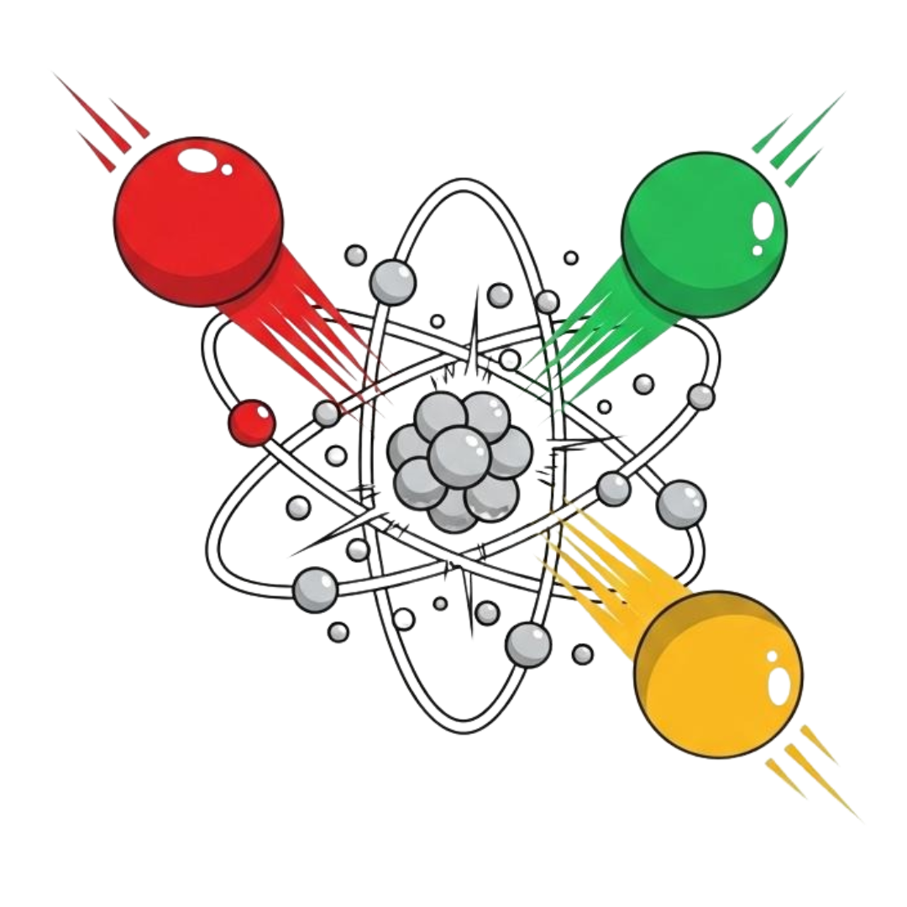

# ⚛️ Chain Reaction — Multiplayer

A real-time multiplayer Chain Reaction browser game with a modern cartoony UI, built with Socket.IO and vanilla JS.

> Inspired by the aesthetics of Paper.io 2, Hole.io, and Agar.io — colorful, premium, and inviting.



---

## 🎮 How to Play

1. **Host or Join** — Create a room and share the 4-letter code, or join with a friend's code.
2. **Place Atoms** — Tap on empty cells or cells you own to place an atom.
3. **Chain Reactions** — When a cell reaches critical mass, it explodes outward, converting neighbors.
4. **Last One Standing** — After opening turns, players with zero atoms are eliminated. The last survivor wins.

### Critical Mass Rules

| Cell Position | Bursts At |
|---|---|
| Corner | 2 atoms |
| Edge | 3 atoms |
| Center | 4 atoms |

---

## 🚀 Quick Start

```bash
# Install dependencies
npm install

# Start the server
npm start

# Open in browser
open http://localhost:4173
```

Open **two browser tabs** to test multiplayer locally. You can override the port:

```bash
PORT=8080 npm start
```

---

## 🏗️ Architecture

### Project Structure

```
├── index.html      # UI: Home screen, lobby, game, winner modal
├── styles.css      # Design system: tokens, 3D buttons, grid bg, toasts
├── game.js         # Client: rendering, game logic, socket events, audio
├── server.js       # Server: Socket.IO, room FSM, validation, rematch flow
├── main.js         # Electron main process (optional desktop mode)
├── preload.js      # Electron preload bridge
├── renderer.js     # Electron window controls
└── Dockerfile      # Container deployment
```

### Server-Side State Machine

```
[lobby] ──startMatch──▶ [playing] ──gameOver──▶ [finished]
   ▲                                                │
   └──────────── all players vote rematch ◀─────────┘
```

- **lobby**: Players join, pick colors/names. Host starts when ≥2 players.
- **playing**: Turn-based gameplay. Server validates turn ownership on every move.
- **finished**: Winner broadcast to all. Cooperative rematch voting (both must agree).

### Multiplayer Edge Cases Handled

| Scenario | Behavior |
|---|---|
| Same color picked | Server rejects with list of available colors |
| Same name in room | Auto-renamed to `Name(2)`, `Name(3)`, etc. |
| Empty name | Rejected with error toast |
| Wrong player clicks | Server silently ignores; client shows toast |
| Player disconnects mid-game | Marked offline, skipped in turns. Auto-win if only 1 remains |
| Player exits after game | "Player left" toast shown to remaining players |
| Rematch | Both players must click Rematch; shows "Waiting (1/2)" until agreed |
| Player leaves during rematch wait | Remaining player notified, vote recalculated |

---

## 🎨 Design System

- **Fonts**: Nunito (body, 600-900 weight) + Lilita One (display headings)
- **Colors**: 6 player colors with depth/light variants, cool-tinted surfaces
- **Buttons**: 3D raised tactile system with `::before` depth + `::after` gloss + `:active` push
- **Background**: Agar.io-style grid + soft color washes + 14 ambient floating orbs
- **Cards**: White, 20px radius, multi-layered shadows, optional gradient accent bar
- **Animations**: Bouncy spring easing (`cubic-bezier(0.34, 1.56, 0.64, 1)`), all under 400ms
- **Audio**: Synthesized button pops, atom placement, explosion, and win sounds (Web Audio API)

---

## 🐳 Docker

```bash
docker build -t chain-reaction .
docker run -p 4173:4173 chain-reaction
```

---

## 📜 License

MIT
